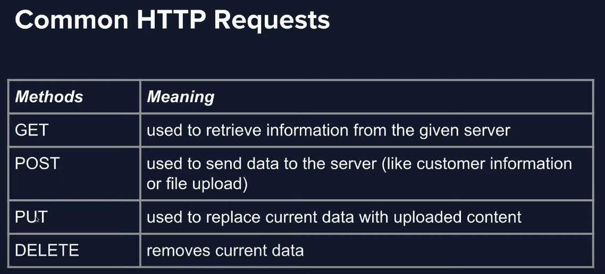
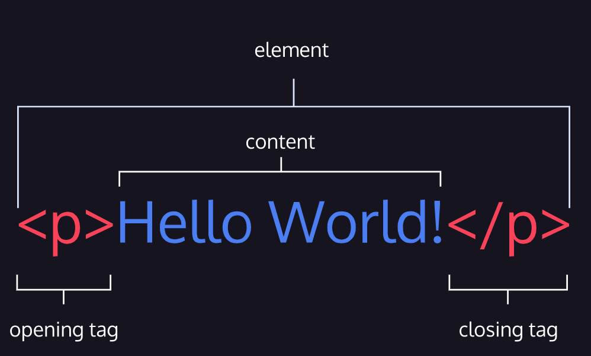

#  1. Welcome to Front-end engineer career path

## 1.1. Main learned skills

- Build web pages with HTML, style them with CSS, and make them interactive with JavaScript.
- Manage versions with Git and work with GitHub.
- Use React and Redux.
- Deploy on Netlify.

## 1.2. Introduction: Overview of Web Development

### 1.2.1. Questions to answer

- How is data sent from one computer to another?
- What's the relationship between a browser and a server?
- How is code turned into the experience that users see in their browsers?
- How have the web and web development changed from their invention to today?

The Internet refers to the actual network of connected computing devices.

The World Wide Web (W3) is a collection of interlinked websites and other web resources. The W3, in combination with the rise of web browsers in the 1990s, introduced a user-friendly interface that enabled users to browse multimedia content and interact with other users.

**The browser** is an app that is capable of managing requests and receiving information between the **_Client_** (user) and the **_Server_**.

The request is sent from your device to a server across the internet. First, the browser takes the address you provided and sends a request to a server across the internet for the files that make up the website. The contacted server is responsible for holding the website's files. Once that server receives the order, it contains logic for processing the request and identifying the files and data that the client has specified. It responds to the browser with the necessary files. This is the process that allows us to see the website that has been requested.

**The server** is a specialized computer connected to a network which provides, or "serves up", resources or services. It has the logic to receive and send back the data needed by the browser.

The internet follows _protocols_ or _rules_ that govern the format of data sent over the internet. The browser and server communicate with one another using the Internet Protocol known as HTTP, which allows for data transfer. In the protocol, each request has a request method that specifies the type of the request been made.

The HTTP has some _status codes_  that indicate whether or not the HTTP request was successfully completed and if there was an error.

| Code   | Explanation |
|:-----: | :------: |
| 200 OK | The request has succeeded.|
| 301 Moved Permanently | The resource has been moved and the client is being redirected.|
| 404 Not Found | The requested resource is not found |
| 500 Internal Server Error | The server encountered an unexpected error|

In general, our devices aren't making a single request. Every time we load a webpage, our device sends a request for each file that makes up that page. The following steps are in general done:

  1. When a user types in a URL and presses enter, the server processes the request and sends the _**HTML**_ file back to the client. HTML files hold the content of a website and they also contain links for any additional assets or code that are needed to display the site properly. HTML stands for _Hypertext Markup Language_.

  2. The browser will begin to search for elements in the HTML file and it will start to make additional HTTP requests for any other external resources used by the HTML file. This often includes:

      - One or more _**CSS**_ stylesheets. CSS stands for _Cascading Style Sheets_; CSS creates the style and layout of a web page. The browser will request the CSS stylesheet, and when the server sends it back, the browser analyzes the CSS and starts applying the visual styles to the content of the site.

      - The request-response cycle also sends website assets, like images and videos, from the server to the browser. If these files are large, there might even be a noticeable delay before they are rendered by the browser.

      - One or more _**JavaScript - JS**_ files. The javascript files make the web page interactive. This programming language functions as the "behavior" of the web page. A web page that does not use JS is known as a static webpage.

In most modern browsers, these additional requests are made in parallel and all of the resources are typically displayed as soon as possible. The whole process happens in about a second or less, depending on the speed of the user's connection, the size of the website, and even the physical distance between the browser and the server.

The web pages have been divided in Web 1.0 and Web 2.0. The web pages 1.0 were the first class of the web pages, called _Static_, because of the lacking of movement. These pages were composed mainly by text, images and links, this last, responsible for linking other pages. On the other hand, the web pages 2.0 are in principle dynamic, offering content that responds to user input without forcing the page to fully reload. In the 2.0's era of the web, the web pages has a huge emphasizing in user-generated content and social sharing, mainly powered by the birth of the blogs, social medias, and wikis.

As technical advances that enabled this new age of the web we can cite:

- jQuery was the first javascript _**Framework**_ that could fetch data while the web page is running. A framework is a software that provides reusable boilerplate code and functionality for building applications. Exemples are: React, Angular, Django, Rails, Flutter, React Native, etc.

- The rise of web frameworks that connected to databases, like Spring, Django, and Ruby-on-Rails, enable user-generated content to effectively be created, stored, and displayed.

Nowadays, we have those new trends:

- The rise of smartphones connected were capable of enhance the interaction between people, and now, accounts for more than half of all internet traffic.

- The rise of responsive web design, created by several additions to the CSS language, like media queries and relative units.

- The rise of internet-connected mobile applications has changed the way that we think about browsing the internet.

## 1.3. The Internet and Web Development

The four main languages that are used to build an website are:

- HTML - that have the function to give a structure to the page;
- CSS - that have the function to apply styles to the page;
- JS - that have the function to add interactivity to the page;
- SQL - that have the function to allow your web application to store and retrieve data.

### 1.3.1. What's HTML?

- HTML is the skeleton of all web pages.
- Provides structure to all objects in a web page.
- Stands for ***Hypertext Markup Language***
  - Markup refers to a way of annotating text is distinguishable from the text itself;
  - HTML separates content and annotations by using HTML tags, which are denoted by angle brackets ("< >");
  - The H and T stands for ***h****iper**t**ext*, that is a text that links to other text;
  - The *hyper* prefix indicates that the text expands beyond the constrains of the written word, when, by clicking on links, we can move from one element to another, or from one document to another. This caracterizes the *navigation* of the web;
  - 

#### 1.3.1.1. HTML Elements

- The tags are annotations that provide information about the type of content they contain;
- The tags surround content to create an HTML ***Element***;

- The image shows a *paragraph element*. It are made by an opening tab `
` (name of the element), the content text "Hello World!", and a closing tag `
`.

