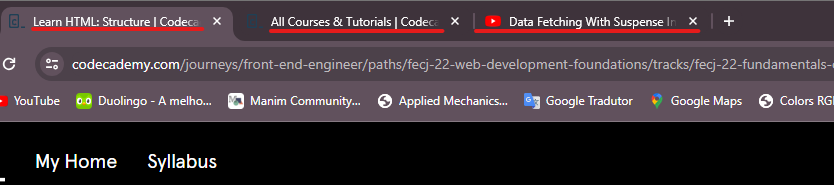
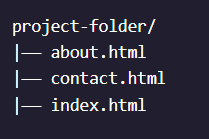

# 1. Fundamentals of HTML

- [ ] Understand how HTML is used for web development;
- [ ] Use HTML to build a structure for a website;
- [ ] Create tables in HTML documents;
- [ ] Write clearer, more accessible HTML using Semantic HTML tags;

A full list of available HTML tags can be found in [Mozilla documentation](https://developer.mozilla.org/en-US/docs/Web/HTML/Element).

## 1.1. Introduction to HTML

- So what exactly is HTML? HTML provides structure to the content appearing on a website, such as images, text, or videos.
- HTML stands for HyperText Markup Language:
  - A markup language is a computer language that defines the structure and presentation of raw text.
  - In HTML, the computer can interpret raw text that is wrapped in HTML elements.
  - HyperText is text displayed on a computer or device that provides access to other text through links, also known as hyperlinks. You probably clicked on a couple of hyperlinks on your way to this Codecademy course.
- A tag (`<tag_name></tag_name>`) and the content between it is called an HTML element. Opening Tag — the first HTML tag used to start an HTML element. The tag type is surrounded by opening and closing angle brackets. Content — The information (text or other elements) contained between the opening and closing tags of an HTML element. Closing tag — the second HTML tag used to end an HTML element. Closing tags have a forward slash (/) inside of them, directly after the left angle bracket.
- One of the key HTML elements we use to build a webpage is the ***Body*** element. Only the content inside the body tags can be displayed in the screen.
  
```html
  <body>
    <p>What's up, man?</p>
  </body>
```

- HTML is organized as a collection of family tree relationships.
- When an element is contained inside another element, it is considered the ***Child*** of that element. The child element is said to be ***Nested*** inside of the parent element.
  
```html
  <body>
    <p>This paragraph ("p" element) is a child of the body</p>
  </body>
```

- The `<p>` element is considered a child of the `<body>` element, and the `<body>` element is considered the parent.

- Consider another example:
  
```html
<body>
  <div>
    <h1>Sibling to p, but also grandchild of body</h1>
    <p>Sibling to h1, but also grandchild of body</p>
  </div>
</body>
```

- In this example, the `<body>` element is the parent of the `<div>` element. Both the `<h1>` and `<p>` elements are children of the `<div>` element. Because the `<h1>` and `<p>` elements are at the same level, they are considered siblings and are both grandchildren of the `<body>` element. This genealogic tree is called ***Hierarchy***.
- It's important know about hierarchy because child elements can inherit behavior and styling from their parent element.
- ***Headings*** in HTML are similar to headings in other types of media. Usually, are used to catch the attention of the user.
- In HTML, there are six different headings, or heading elements.

```html
<h1>The Urge for Learning!</h1>
```

## 1.2. Learn HTML: Elements

- One of the most popular elements in HTML is the `<div>` element. `<div>` is short for “***division***” or a container that divides the page into sections.

```html
<body>
  <div>
    <h1>Why use divs?</h1>
    <p>Great for grouping elements!</p>
  </div>
</body>
```

- `<div>`s allow us to group HTML elements to apply the same styles for all HTML elements inside. We can also style the `<div>` element as a whole.
- *Attributes* are content added to the opening tag of an element and can be used in several different ways, from providing information to changing styling.
- Attributes are made up of the following two parts: `name="value"`.
- One commonly used attribute is the id. We can use the id attribute to specify different content (such as `<div>`s) and is really helpful when you use an element more than once. ids have several different purposes in HTML, but for now, we’ll focus on how they can help us identify content on our page.

```html
<div id="intro">
  <h1>Introduction</h1>
</div>
```

- If you want to display text in HTML, you can use a ***Paragraph*** or ***Span***:
  - Paragraphs `<p>` contain a block of plain text.
  - `<span>` contains short pieces of text or other HTML. They are used to separate small pieces of content that are on the same line as other content.

```html
<div>
  <h1>Technology</h1>
</div>
<div>
  <p><span>Self-driving cars</span> are anticipated to replace up to 2
  million jobs over the next two decades.</p>
</div>
```

- In the example above, there are two different `<div>`. The second `<div>` contains a `<p>` with `<span>`Self-driving cars`</span>`. This `<span>` element separates “Self-driving cars” from the rest of the text in the paragraph.
- You can also style text using HTML tags. The `<em>` tag emphasizes text, while the `<strong>` tag highlights important text.
  - The `<em>` tag will generally render as ***Italic Emphasis***.
  - The `<strong>` will generally render as ***Bold Emphasis***.
- If you are interested in modifying the spacing in the browser, you can use HTML’s line break element: `<br>`. The line break element is unique because it is only composed of a starting tag.
- In HTML, you can use an ***Unordered List*** tag `<ul>` to create a list of items in no particular order. This use a bullet point.
- ***Individual List*** items must be added to the unordered list using the `<li>` tag. The `<li>` or list item tag is used to describe an item in a list.
- ***Ordered lists*** `<ol>` are like unordered lists, except that each list item is numbered.
- The `` tag allows you to add an ***Image*** to a web page. Most elements require both opening and closing tags, but the `` tag is a ***Self-Closing*** tag. Self-closing tags may include or omit the final slash ( "/" ) — both will render properly.

```html
 or 
```

- The `` tag has a required attribute called **`src`**. The `src` attribute must be set to the image’s source, or the location of the image (on the web or local).
- The **`alt`** attribute, which means ***Alternative Text***, brings meaning to the images on our sites. The `alt` attribute can be added to the image tag just like the `src` attribute. The value of `alt` should be a description of the image. If the image doesn't be loaded, or in case of an user be visually impaired, the alt attribute will give the information about the image in the site.

```html

```

- The `alt` attribute also plays a role in Search Engine Optimization (SEO), because search engines cannot “see” the images on websites as they crawl the internet. Having descriptive `alt` attributes can improve the ranking of your site.
- In addition to images, HTML also supports displaying ***Videos***. Like the `` element, the `<video>` element requires a src attribute with a link to the video source. Unlike the `` element however, the `<video>` element requires an opening and a closing tag.

```html
<video src="myVideo.mp4" width="320" height="240" controls>
  Video not supported
</video>
```

- After the `src` attribute, the `width` and `height` attributes are used to set the size of the video displayed in the browser. The `controls` attribute instructs the browser to include basic video controls such as pausing and playing.

## 1.3. Learn HTML: Structure

### 1.3.1. The DOCTYPE Tag

- HTML files require certain elements to set up the document properly. We can let web browsers know that we are using HTML by starting our document with a document type declaration. The declaration looks like this:

```html
<!DOCTYPE html>
```

- This declaration is an instruction, and it *must be the first line of code* in your HTML document. The declaration is referring to HTML5, as it is the current standard.
- Lastly, HTML code is always saved in a file with an **`.html`** extension.

### 1.3.2. HTML Tab

- To create HTML structure and content, we must add opening and closing `<html>` tags after declaring `<!DOCTYPE html>`:

```html
<!DOCTYPE html>
<html>
  <!--Anything between the opening <html> and closing </html> tags will be interpreted as HTML code.-->
</html>
```

### 1.3.3. HEAD Tag

- The `<head>` element is part of this HTML metaphor. It goes above our `<body>` element.
- The `<head>` element contains the metadata for a web page. Metadata is information about the page that isn’t displayed directly on the web page.
- A browser’s tab displays the title specified in the `<title>` tag. The `<title>` tag is always inside of the `<head>`.

```html
<!DOCTYPE html>
<html>
  <head>
    <title>My Coding Journal</title>
  </head>
</html>
```



### 1.3.4. ANCHOR Tag - Linking to Other Web Pages

- You can add links to a web page by adding an anchor element `<a>` and including the text of the link in between the opening and closing tags.
- The anchor element must contain the `href="https://someURL.com"` attribute. This attribute stands for ***h**ypertext **ref**erence* and is used to link to a path, or the address to where a file is located (whether it is on your computer or another location). The paths provided to the href attribute are often URLs.

```html
<a href="https://www.wikipedia.org/">This Is A Link To Wikipedia</a>
```

- The `target` attribute specifies how a link should open. For a link to open in a new window, the `target` attribute requires a value of `_blank`.

```html
<a href="https://en.wikipedia.org/wiki/Brown_bear" target="_blank">The Brown Bear</a>
```

- The `target="_blank"` attribute, when used in modern browsers, will open new websites in a new tab. There are other attributes like `_self` and `_parent` (see [Anchor Atributes](https://developer.mozilla.org/en-US/docs/Web/HTML/Element/a#target)).

#### 1.3.4.1. Linking to Relative Pages

- Many sites also link to internal web pages like *Home*, *About*, and *Contact*.
- When making multi-page static websites, web developers often store HTML files in the ***root directory***, or a ***main folder*** where all the files for the project are stored. As the size of the projects you create grows, you may use additional folders within the main project folder to organize your code.
  


- The example above shows three different files — `about.html`, `contact.html`, and `index.html` in one folder.
- If the browser is currently displaying `index.html`, it also knows that `about.html` and `contact.html` are in the same folder. Because the files are stored in the same folder, we can link web pages together using a relative path.

```html
<a href="./contact.html">Contact</a>
```

- The `./` in `./index.html` tells the browser to look for the file in the current folder.

#### 1.3.4.2. Linking At Will

- Links not necessarily needs to be text. They can be images or other form of web content.
- HTML allows you to turn nearly any element into a link by wrapping that element with an anchor element. With this technique, it’s possible to turn images into links by simply wrapping the `` element with an `<a>` element.

```html
<a href="https://en.wikipedia.org/wiki/Opuntia" target="_blank">
  
</a>
```

#### 1.3.4.3. Linking to Same Page

- When users visit our site, we want them to be able to click a link and have the page automatically scroll to a specific section.
- In order to link to a target on the same page, we must give ***the target*** an **`id`**. An `id` should be descriptive to make it easier to remember the purpose of a link. The ***target link*** is a string containing the **`#`** character and the target element’s `id`.

```html
<ol>
  <!--References to a top id.-->
 <li><a href="#top">Top</a></li>
  <!--References to a bottom id.-->
 <li><a href="#bottom">Bottom</a></li>
</ol>
```

- An id is especially helpful for organizing content belonging to a `div`!

### 1.3.5. Whitespace

- Programmers use two tools to visualize the relationship between elements: ***whitespace*** and ***indentation***.
- The browser ignores whitespace in HTML files when it renders a web page, so it can be used as a tool to make code easier to read and follow.
- The [World Wide Web Consortium](https://www.w3.org/), or W3C, is responsible for maintaining the style standards of HTML. At the time of writing, the W3C recommends ***2 spaces of indentation*** when writing HTML code.

### Comments

- Comments begin with `<!--` and end with `-->`. Any characters in between will be ignored by your browser.
- Including comments in your code is helpful for many reasons: i) They help you (and others) understand your code if you decide to come back and review it at a much later date; ii) They allow you to experiment with new code, without having to delete old code.
