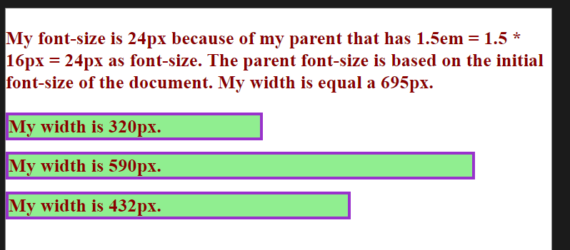
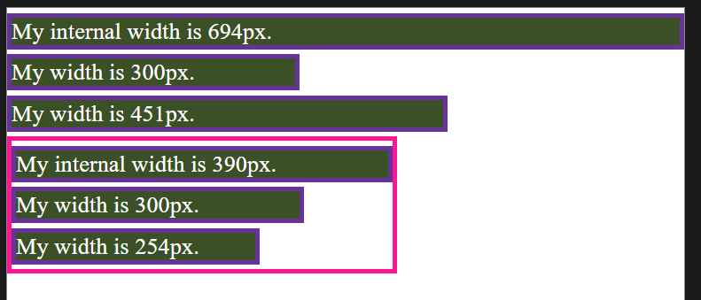
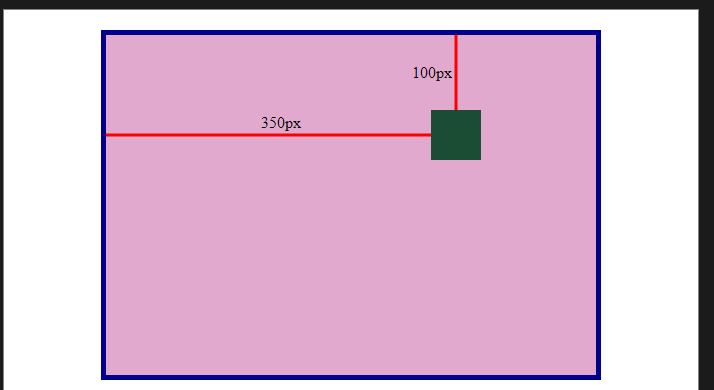
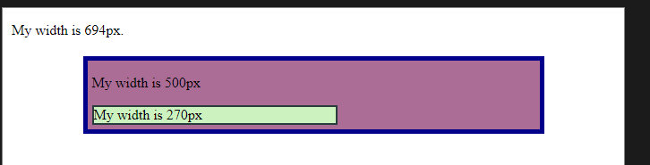
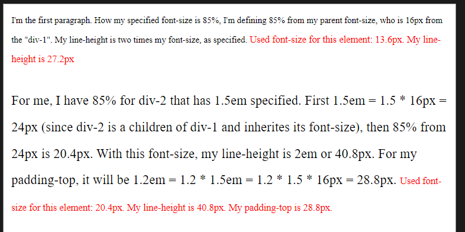

# 1 Learn CSS - Selectors and Visual Rules	

## 1.1 Setup and Syntax

- _**Cascading Style Sheets**_ or **CSS** is a language web developers use to style the HTML content on a web page.
- The CSS has two different syntaxes rules. The first is known as _Ruleset_, that is commonly used as a separate file, or inside a style tag. The second is known as _Inline Style_, that is a use in the HTML tag itself.

<p style="font-size: 20px; font-weight: 800; color: rgba(250, 200, 155, 0.8)">RULESET</p>
```css
selector {
  property: value;
}
```

<p style="font-size: 20px; font-weight: 800; color: rgba(250, 200, 155, 0.8)">INLINE STYLE</p>
```html
<tag style="property: value"></tag>
```


- Both methods contain common features in their _{++anatomy++}_. Notice how both syntaxes contain a declaration. Declarations are the core of CSS. They apply a style to the selected element.

### 1.1.1 Ruleset Terms

- **_Selector_** — The beginning of the ruleset used to target the element that will be styled.
- **_Declaration Block_** — The code in-between (and including) the curly braces ({ }) that contains the CSS declaration(s).
- **_Declaration_** — The group name for a property and value pair that applies a style to the selected element.
- **_Property_** — The first part of the declaration that signifies what visual characteristic of the element is to be modified.
- **_Value_** — The second part of the declaration that signifies the value of the property.

### 1.1.2 Inline Style Terms

- _**Opening Tag**_ — The start of an HTML element. This is the element that will be styled.
- **_Attribute_** — The style attribute is used to add CSS inline styles to an HTML element.
- _Declaration_ — The group name for a property and value pair that applies a style to the selected element.
- **_Property_** — The first part of the declaration that signifies what visual characteristic of the element is to be modified.
- **_Value_** — The second part of the declaration that signifies the value of the property.

### 1.1.3 Inline Styles

- Add the style attribute directly to the opening tag. After you add the attribute, you can set it equal to the CSS style(s) you'd like applied to that element. ^3a3ca8

```html
<p style="color:red;">I'm learning to code!</p>
```

### 1.1.4 Internal Stylesheet

- HTML allows you to write CSS code in its own dedicated section with a `<style>` element **nested inside** of the `<head>` element. The CSS code inside the `<style>` element is often referred to as an _internal stylesheet_.

```html {highlight=4-5}
<head>
  <style>
    p {
      color: red;
      font-size: 20px;
    }
  </style>
</head>
```

- The CSS code in the example above changes the color of all paragraph text to red (`color: red;`) and also changes the size of the text to 20 pixels (`font-size: 20px;`).

### 1.1.5 External Stylesheet and How to Link the CSS Files

- Developers avoid mixing code by storing HTML and CSS code in separate files (HTML files contain only HTML code, and CSS files contain only CSS code).
- You can create an external stylesheet by using the `.css` file name extension, like so: `style.css`
- With an external stylesheet, you can write all the CSS code needed to style a page without sacrificing the readability and maintainability of your HTML file.
- You can use the `<link>` element to link HTML and CSS files together. The `<link>` element must be placed within the head of the HTML file. _**It is a self-closing tag**_ and requires the following attributes:
  - `href` — like the anchor element, the value of this attribute _must be the address, or path, to the CSS file_.
  - `rel` — this attribute describes the relationship between the HTML file and the CSS file. Because you are linking to a stylesheet, the value should be set to _stylesheet_.

```html
<link href="URL_to_CSS_file" rel="stylesheet" />
```

- If the CSS file is stored in the same directory as your HTML file, then you can specify a _Relative Path_ instead of a URL, like so:

```html
<link href="./style.css" rel="stylesheet" />
```

## 1.2 Selectors

- Remember that _declarations_ are a fundamental part of CSS because they apply a style to a selected element. But how do you decide which elements will get the style? With a selector.
- A _**selector**_ is used to target the specific HTML element(s) to be styled by the declaration.
- One selector very familiar is the _**Type Selector**_. Just like its name suggests, the type selector _matches the type of the element in the HTML document_.
- Some important notes on the type selector:
  - The type selector does not include the angle brackets.
  - Since element types are often referred to by their opening tag name, the type selector is sometimes referred to as the tag name or element selector.

### 1.2.1 Universal Selector

- The universal selector selects all elements of any type.
- Targeting all of the elements on the page has a few specific use cases, such as resetting default browser styling, or selecting all _**CHILDREN**_ of a _**PARENT**_ element.

  - The Parent and Children names are used to describe the relation between two or more HTML or CSS elements. For example:

```html
<main>
	<section>
	    <h1></h1>
    </section>
</main>
```

  - In this case we have that `<section>` and `<h1>` are _CHILDREN_ of `<main>`, with `<h1>` been children of `<section` too. `<main>` is a PARENT for `<section>` and `<section>` for `<h1>`.

- The universal selector uses the `*` (asterisk) character in the same place where you specified the type selector in a ruleset, like so:

```css
* {
  font-family: Verdana;
}
```

- In this last case, the font type Verdana was specified for all text elements in the document.

### 1.2.2 :warning: CLASS :warning:

- When working with HTML and CSS a class attribute is one of the most common ways to select an element.
- For example, consider the following HTML:

```html
<p class="brand">Sole Shoe Company</p>
```

- The paragraph element in the example above has a class attribute within the opening tag of the `<p>` element. The class attribute is set to **`'brand'`**. To select this element using CSS, we can create a ruleset with a class selector of `.brand`.
- To select an HTML element by its class using CSS, a period (`.`) must be prepended to the class's name. In the example above, the class is `brand`, so the CSS selector for it is `.brand`.
- Multiple classes can be assigned to a single element in a space-separated list, e.g, `class="class1 class2 class3"`.
- We can add multiple classes to an HTML element’s class attribute by separating them with a space. This enables us to mix and match CSS classes to create many unique styles without writing a custom class for every style combination needed.
- For `JavaScript` the class attribute can also be used to perform `JavaScript` operations on HTML elements. Through the _**Document Object Model (“DOM”)**_, there are various `JavaScript` methods built for selecting elements via their class.

```js
window.onload = function () {
  const subheadings = document.getElementsByClassName("sub-heading");

  for (let i = 0; i < subheadings.length; i++) {
    subheadings.item(i).innerText = `Sub-heading ${i + 1}`;
  }
};
```

- The code above is assigning an event handler to the `onload` property of the global `window` object in the browser. When the `window` as loaded, the elements with `class=sub-heading` are collected in `subheadings`. They are then looped over, their `innerText` property being changed each iteration.

### 1.2.3 ID

- Oftentimes it’s important to select a single element with CSS to give it its own unique style. If an HTML element needs to be styled uniquely, we can give it an _**ID**_ using the `id` attribute.

```html
<h1 id="large-title">...</h1>
```

- In contrast to class which accepts multiple values, and can be used broadly throughout an HTML document, **{++an element’s id can only have a single value++}**, and only be used once per page.
- To select an element’s ID with CSS, we prepend the id name with a number sign (#). In the preceding example, we can use `#large-title` to select the `<h1>` element with the same ID.

### 1.2.4 ATTRIBUTE

- The attribute selector can be used to target HTML elements that already contain attributes. Elements of the same type can be targeted differently by their attribute or attribute value. This alleviates the need to add new code, like the class or id attributes.
- Attributes can be selected similarly to types, classes, and IDs.

```css
[href] {
  color: magenta;
}
```

- The most basic syntax is an attribute surrounded by square brackets. In the above example: `[href]` would target all elements with an `href` attribute and set the color to magenta.

- And it can get more granular from there by adding type and/or attribute values. One way is by using `type[attribute*=value]`. In short, this code selects an element where the attribute contains any instance of the specified value. Let’s take a look at an example.

```html
 
```

- The HTML code above renders two `` elements, each containing a `src` attribute with a value equaling a link to an image file.

```css
img[src*="winter"] {
  height: 50px;
}

img[src*="summer"] {
  height: 100px;
}
```

- Now take a look at the above CSS code. The attribute selector is used to target each image individually. The first ruleset looks for an `img` element with an attribute of `src` that contains the string `'winter'`, and sets the `height` to `50px`. The second ruleset looks for an `img` element with an attribute of `src` that contains the string `'summer'`, and sets the `height` to `100px`.

### 1.2.5 Pseudo-Class (sudo-class)

- You may have observed how the appearance of certain elements can change, or be in a different state, after certain user interactions. For instance:
  - When you click on an `<input>` element, and a blue border is added showing that it is in focus.
  - When you click on a blue `<a>` link to visit to another page, but when you return the link’s text is purple.
  - When you’re filling out a form and the submit button is grayed out and _**disabled**_. But when all of the fields have been filled out, the button has color showing that it’s active.
- These are all examples of pseudo-class selectors in action! In fact,

  - `:focus`
  - `:visited`
  - `:disabled`
  - `:active`

  are all pseudo-classes. Factors such as user interaction, site navigation, and position in the document tree can all give elements a different state with pseudo-class.

- A pseudo-class can be attached to any selector. It is always written as a colon `:` followed by a name. For example `p:hover`.

```css
p:hover {
  background-color: lime;
}
```

### 1.2.6 CLASSES and IDs

- CSS classes and IDs have different purposes, which can affect which one you use to style HTML elements.
- CSS classes are meant to be _**reused over many elements**_. By writing CSS classes, you can style elements in a variety of ways by mixing classes.

  - For instance, imagine a page with two headlines. One headline needs to be bold and blue, and the other needs to be bold and green.
  - Instead of writing separate CSS rules for each headline that repeat each other’s code, it’s better to write a `.bold` CSS rule, a `.green` CSS rule, and a `.blue` CSS rule. Then you can give one headline the bold green classes, and the other the bold blue classes.

- While classes are meant to be used many times, an ID is meant to style only one element. IDs override the styles of types and classes. Since IDs override these styles, they should be used sparingly and only on elements that need to always appear the same.

### 1.2.7 Specificity

- Specificity is the order by which the browser decides which CSS styles will be displayed.
- A best practice in CSS is to style elements while using the lowest degree of specificity so that if an element needs a new style, it is easy to override.
- IDs are the most specific selector in CSS, followed by classes, and finally, type.
- For the selector that combines `type` and an `attribute` we have that will be superior at the `class` selector but inferior to the `id` selector.

````ad-example

<br>

```html
	<h1 class="headline">Breaking News</h1>
```

<br/>

```css
h1 {
  color: red;
.headline {
  color: firebrick;
}
```
In the example code above, the `color` of the heading would be set to `firebrick`, as the class selector is more specific than the type selector.
````

- If an ID attribute (and selector) were added to the code above, the styles within the ID selector’s body would override all other styles for the heading.
- To make styles easy to edit, it’s best to style with a type selector, if possible. If not, add a class selector. If that is not specific enough, then consider using an ID selector.

### 1.2.8 Chaining

- When writing CSS rules, it’s possible to require an HTML element to have two or more CSS selectors at the same time.
- This is done by combining multiple selectors, which we will refer to as chaining. For instance, if there was a `special` class for `<h1>` elements, the CSS would look like below:

```css
h1.special {
}
```

- The code above would select only the `<h1>` elements with a class of `special`. If a `<p>` element also had a class of `special`, the rule in the example would not style the paragraph.
- This combined selector will have the same position that the `type[attribute=value]` selector.

### 1.2.9 Descendant Combinator

- CSS also supports selecting elements that are nested within other HTML elements, also known as _**descendants**_. For instance, consider the following HTML:

```html
<ul class="main-list">
  <li>...</li>
  <li>...</li>
  <li>...</li>
</ul>
```

- The nested `<li>` elements are descendants of the `<ul>` element and can be selected with the descendant combinator like so:

```css
.main-list li {
}
```

- In the example above, `.main-list` selects the element with the`.main-list` class (the `<ul>` element). The descendant `<li>`‘s are selected by adding li to the selector, separated by a space. This results in .main-list li as the final selector.
- Selecting elements in this way can make our selectors even more specific by making sure they appear in the context we expect.

### 1.2.10 Multiple Selectors

- In order to make CSS more concise, it’s possible to add CSS styles to multiple CSS selectors all at once. This prevents writing repetitive code.
- For instance, the following code has repetitive style attributes:

```css
h1 {
  font-family: Georgia;
}

.menu {
  font-family: Georgia;
}
```

- Instead of writing `font-family: Georgia` twice for two selectors, we can separate the selectors by a comma (`,`) to apply the same style to both, like this:

```css
h1,
.menu {
  font-family: Georgia;
}
```

- By separating the CSS selectors with a comma, both the `<h1>` elements and the elements with the menu class will receive the `font-family: Georgia` styling.

## 1.3 Values and Syntax

- Before entering the specific properties that we have, it's important to understand what's a CSS value, how the values in CSS are computed, and how value definition syntax is used, for example, in the suggestions on an IDE.
- First, let's begin with the definition of a CSS value and your data types.
- Secondly, we'll see how the values are specified and computed. We have a distinction between five different ways to calculate a value of a property. They are:
  - [[#1.3.2. Initial value|Initial Value]];
  - [[#1.3.3. Specified Value|Specified Value]];
  - [[#1.3.4. Computed Value|Computed Value]];
  - [[#1.3.5. Used Value|Used Value]];
  - [[#1.3.6. Actual Value|Actual Value]].
- Lastly, we will define the common syntax in guides, references, editors and IDEs for CSS values.

### 1.3.1 What's a CSS Value?

- In CSS specifications and on the property pages in web, you will be able to spot value types as they will be surrounded by angle brackets, such as `<color>` or `<length>`. When you see the value type `<color>` as valid for a particular property, that means you can use any valid color as a value for that property, as listed on the `<color>` reference page.
- A _value type_ in CSS is a way to define a collection of allowable values. This means that if you see `<color>` as valid you don't need to wonder which of the different types of color value can be used — keywords, hex values, `rgb()` functions, etc. You can use any available `<color>` values, assuming they are supported by your browser.

#### 1.3.1.1 Numbers, Lengths, and Percentages

- There are various numeric value types that you might find yourself using in CSS. The following are all classed as numeric:

| Data type | Description |
| :-: | --- |
| `<integer>` | An `<integer>` is a whole number such as 1024 or -55. |
| `<number>` | A `<number>` represents a decimal number — it may or may not have a decimal point with a fractional component. For example, 0.255, 128, or -1.2. |
| `<dimension>` | A `<dimension>` is a `<number>` with a unit attached to it. For example, `45deg`, `5s`, or `10px`. `<dimension>` is an umbrella category that includes the `<length>`, `<angle>`, `<time>`, and `<resolution>` types. |
| `<percentage>` | A `<percentage>` represents a fraction of some other value. For example, `50%`. Percentage values are always relative to another quantity. For example, an element's length is relative to its parent element's length. |

#### 1.3.1.2 Lengths

- The numeric type you will come across most frequently is `<length>`.
- For example, `10px` (pixels) or `30em`. There are two types of lengths used in CSS — _**relative and absolute**_. It's important to know the difference in order to understand how big things will become.

##### 1.3.1.2.1 Absolute Length Units

- The following are all absolute length units — they are not relative to **anything** else, and are generally considered to **always be the same size**.

| Unit |        Name         | Equivalent to            |
| :--: | :-----------------: | ------------------------ |
|  cm  |     Centimeters     | 1cm = 37.8px = 25.2/64in |
|  mm  |     Millimeters     | 1mm = 1/10th of 1cm      |
|  Q   | Quarter-millimeters | 1Q = 1/40th of 1cm       |
|  in  |       Inches        | 1in = 2.54cm = 96px      |
|  pc  |        Picas        | 1pc = 1/6th of 1in       |
|  pt  |       Points        | 1pt = 1/72nd of 1in      |
| `px` |       Pixels        | 1px = 1/96th of 1in      |

- Most of these units are more useful when used for print, rather than screen output. For example, we don't typically use cm (centimeters) on screen. _The only value that you will commonly use is px (pixels)_.

##### 1.3.1.2.2 Relative length units

- Relative length units are **relative to something else**, perhaps the _size of the parent element's font_, or the _size of the viewport_.
- The benefit of using relative units is that with some careful planning you can make it so the size of text or other elements scales relative to everything else on the page. Some of the most useful units for web development are listed in the table below.

|   Unit   | Relative to                                                                                                                                                       |
| :------: | ----------------------------------------------------------------------------------------------------------------------------------------------------------------- |
|   `em`   | Font size of the parent, in the case of typographical properties like font-size, and font size of the element itself, in the case of other properties like width. |
|    ex    | x-height of the element's font.                                                                                                                                   |
|    ch    | The advance measure (width) of the glyph "`0`" of the element's font.                                                                                             |
|  `rem`   | Font size of the root element.                                                                                                                                    |
|    lh    | Line height of the element.                                                                                                                                       |
|   rlh    | Line height of the root element. When used on the font-size or line-height properties of the root element, it refers to the properties' initial value.            |
|   `vw`   | 1% of the viewport's width.                                                                                                                                       |
|   `vh`   | 1% of the viewport's height.                                                                                                                                      |
|  `vmin`  | 1% of the viewport's smaller dimension.                                                                                                                           |
|  `vmax`  | 1% of the viewport's larger dimension.                                                                                                                            |
|    vb    | 1% of the size of the initial containing block in the direction of the root element's block axis.                                                                 |
|    vi    | 1% of the size of the initial containing block in the direction of the root element's inline axis.                                                                |
| svw, svh | 1% of the small viewport's width and height, respectively.                                                                                                        |
| lvw, lvh | 1% of the large viewport's width and height, respectively.                                                                                                        |
| dvw, dvh | 1% of the dynamic viewport's width and height, respectively.                                                                                                      |

````ad-example

<br>

```css
.wrapper {
  font-size: 1.5em;
}
div {
  color: darkred;
  font-weight: 800;
}
.box {
  border: 4px solid darkorchid;
  background-color: lightgreen;
  margin-top: 15px;
}
.px {
  width: 320px;
}
.vw {
  width: 85vw;
}
.em {
  width: 18em;
}
```

<br>

```html
<div class="wrapper">
  <p class="fontSize-div"></p>
  <div class="box px"></div>
  <div class="box vw"></div>
  <div class="box em"></div>
</div>
```

<br>

```javascript
function showFontSize(className) {
  if (className === ".fontSize-div") {
    const paragraph = document.querySelector(className);
    const fontSizeParagraph = window.getComputedStyle(paragraph)["font-size"];
    const paragraphWidth = window.getComputedStyle(paragraph)["width"];
    console.log(paragraphWidth);
    paragraph.textContent = `My font-size is ${fontSizeParagraph} because of my     parent that has 1.5em = 1.5 * 16px = 24px as font-size. The parent font-size    is based on the initial font-size of the document. My width is equal a    ${Math.round(parseFloat(paragraphWidth))}px.`;
  } else {
    const boxesDiv = document.getElementsByClassName(className)
    for (let i = 0; i < boxesDiv.length; i++) {
      const box = boxesDiv[i];
      const widthBox = window.getComputedStyle(box)["width"];
      box.textContent = `My width is ${Math.round(parseFloat(widthBox))}px.`;
    }
  }
showFontSize(".fontSize-div");
showFontSize("box");
```

Here the `font-size` of the external `div` is set as `1.5em` while the `font-size` of the document is `16px`, so the `font-size` of the external `div` will be `24px`. In the first internal `div`, the `width` is specified as `320px`, so is an absolute value. For the second internal `div`, the `width` is specified as `85vw`, i.e., `85%` from the width of the viewport. How the viewport has `695px` as width, the `div` will be `0.85 * 695px = 590.75px` (at the output the approximate value is shown). For the third internal `div`, your `width` is specified as `18em`, which will be 18 times the `font-size` of this `div` that's `24px`, so, the calculated value will be `18 * 24px = 432px`.
````

#### 1.3.1.3 Percentages

- In a lot of cases, a percentage is treated in the same way as a length. The thing with percentages is that they are _**always set relative to some other value**_.
- For example, if you set an element's `font-size` as a percentage, it will be a percentage of the `font-size` of the element's parent. If you use a percentage for a `width` value, it will be a percentage of the `width` of the parent.

````ad-example

<br>

```css
.wrapper {
  width: 400px;
  border: 5px solid deeppink;
}
.box {
  margin-top: 5px;
  margin-bottom: 5px;
  border: 5px solid rebeccapurple;
  background-color: rgb(60 20 30);
}
.px {
  width: 300px;
}
.percent {
  width: 65%;''
}
```

<br>

```html
<div class="box txt widthHTML"></div>
<div class="box px txt"></div>
<div class="box percent txt"></div>
<div class="wrapper">
  <div class="box txt widthHTML"></div>
  <div class="box px txt"></div>
  <div class="box percent txt"></div>
</div>
```

<br>

```javascript
function usedWidth(className) {
  if (className === "widthHTML") {
    const divUsed = document.getElementsByClassName(className);
    for (let i = 0; i < divUsed.length; i++) {
      const div = divUsed[i];
      const width = window.getComputedStyle(div)["width"];
      div.textContent = `My internal width is ${parseInt(width)}px.`;
    }
  } else {
    const divUsed = document.getElementsByClassName(className);
    for (let i = 0; i < divUsed.length; i++) {
      const div = divUsed[i];
      const width = window.getComputedStyle(div)["width"];
      div.textContent = `My width is ${parseInt(width)}px.`;
    }
  }
}
usedWidth("widthHTML");
usedWidth("px");
usedWidth("percent");
```

The `width` of the second and fourth `div`s are specified as `300px`, so its an absolute value. For the third and fifth `div`s, the `width` is specified as `65%`, so it'll be calculated from the `width` of your respective parent. For the third `div`, how the width of the `body` is `694px`, your width will be `65% * 694px ≊ 451px`. For the fifth `div`, its parent has `390px` as `width`. So, the `div` will have `65% * 390px ≊ 254px`.
````

#### 1.3.1.4 Numbers

- Some value types accept numbers, _without any unit_ added to them.
- An example of a property which accepts a unitless number is the `opacity` property, which controls the opacity of an element (how transparent it is). This property accepts a number between `0` (fully transparent) and `1` (fully opaque).

#### 1.3.1.5 Color

- Color values can be used in many places in CSS, whether you are specifying the color of text, backgrounds, borders, and lots more.
- There are some different ways to specify color properties: using keywords, hexadecimal, and rgb() values, are the most usual.
- Despite the aforementioned ways, there are other ways of applying color, mainly guided by the use of functions.
- Let's see these methods:
  - `keywords` --- Also known as _named colors_. Defined by `<named-color>` date type, contains a name of color, as `red`, `green`, `blue`, `black`, `white`, etc.; [color list](https://www.w3schools.com/colors/colors_names.asp)
  - `hexadecimal` --- uses 16 characters from `0-9` and `a-f`, each hex color consisting of a hash (`#`) followed by three or six hexadecimal characters (`#fcc` or `#ffc0cb`), plus an optional one or two hexadecimal to represent the alpha-transparency;
    - Each pair of hex characters is a decimal number representing one of the channels --- red, green, and blue --- and allows to specify any of the 256 available values for each (`16 x 16 = 256`);
    - For example, the color `#02798b` is equal to `rgb(2, 121, 139)`;
  - `rgb()` --- takes three parameters representing red, green, and blue channel values of the colors, as `rgb(64, 167, 114)`
    - For the transparency, we can pass a fourth value between 0 and 1 (inclusive) to represent the opacity (0 is without color and 1 is the fully color), as `rgb(64, 167, 114, .3)` or as `rgb(64, 167, 114, .7)`;
    - For older browsers, a `rgba()` function could be used instead for ends of compatibility. So, `rgb(64, 167, 114, .3) = rgba(64, 167, 114, .3)`;
  - `sRGB` --- or Standard Red Green Blue, is a color space used by computing devices to display colors. Created cooperatively by HP and Microsoft in 1996 to use on monitors, printers, and the World Wide Web.
  - `hsl()` --- uses Hue (the property that allows us to tell the difference or similarity between colors like red, orange, yellow, green, blue, etc.), in addition to Saturation and Lightness:
    - Hue --- The base shade of the color. This takes a `<hue>` value between 0 and 360, representing the angles around a color wheel.
    - Saturation: How saturated is the color? This takes a value from 0–100%, where 0 is no color (it will appear as a shade of grey), and 100% is full color saturation.
    - Lightness: How light or bright is the color? This takes a value from 0–100%, where 0 is no light (it will appear completely black) and 100% is full light (it will appear completely white). The hsl() color value also has an optional fourth value, separated from the color with a slash (/), representing the alpha transparency.
    - `hsl(321 47% 57%) = rgb(197, 94, 161)`. [Conversion](https://www.rapidtables.com/convert/color/hsl-to-rgb.html);
  - [Other colors](https://developer.mozilla.org/en-US/docs/Learn/CSS/Building_blocks/Values_and_units#color)

#### 1.3.1.6 Position

- The `<position>` value type represents a set of _2D coordinates_, used to position an item such as a background image (via background-position).
- It can take keywords such as `top`, `left`, `bottom`, `right`, and `center` to align items with specific bounds of a 2D box, along with lengths, which **represent offsets from the top and left-hand edges of the box**.
- A typical position value consists of two values: **the first sets the position horizontally**; **the second vertically**.
- If you only specify values for one axis the other will default to `center`.

````ad-example

<br>

```html
<div class="box">
  <div class="object"></div>
</div>
```

<br>

```css
.box {
  position: relative;
  box-sizing: border-box;
  width: 500px;
  height: 350px;
  background-color: hsl(321 47% 77%);
  margin: 20px auto;
  border: 5px solid darkblue;
}
.object {
  width: 50px;
  height: 50px;
  position: absolute;
  background-color: hsl(150 50% 20%);
  top: 100px;
  left: 350px;
  transform: translate(-50%, -50%);
}
```

In this case, the `position` is a `keyword` property, `absolute`, that makes the `div`, which represents the inner rectangle, capable of being positioned in the external `div` by the `top` and `left` properties, which are the positions relative to the up corner on the left.
````

#### 1.3.1.7 Functions

- CSS also has functions, which work in a similar way to functions in other languages. In fact, we've already seen CSS functions in the [[#1.3.1.5. Color|Color section]] above with `rgb()` and `hsl()` functions.
- Aside from applying colors, you can use functions in CSS to do a lot of other things. For example _**Transform functions**_ are a common way to move, rotate, and scale elements on a page. You might see `translate()` for moving something horizontally or vertically, `rotate()` to rotate something, or `scale()` to make something bigger or smaller.
- These functions can be passed as usual values to a property.

#### 1.3.1.8 Math functions

- CSS has support for **Math functions**, which allow us to perform calculations instead of relying on static values or doing the math in JavaScript. One of the most common math functions is `calc()` which lets you do operations like addition, subtraction, multiplication, and division.
- For example, let's say we want to set the `width` of an element to be `20%` of its parent container plus `100px`. We can't specify this width with a static value — if the parent uses a percentage `width` (or a relative unit like em or rem) then it will vary depending on the context it is used in, and other factors such as the user's device or browser window `width`.
- However, we can use `calc()` to set the `width` of the element to be `20%` of its parent container plus `100px`. The `20%` is based on the width of the parent container and if that `width` changes, the calculation will change too.

````ad-example

<br>

```html
<p class="html"></p>
<div class="box">
  <div class="txt"></div>
</div>
```

<br>

```css
.box {
  padding: 20px;
  width: 500px;
  background-color: hsl(321 27% 55%);
  margin: 20px auto;
  border: 5px solid darkblue;
}
.txt {
  width: calc(30% + 120px);
  background-color: hsl(105 67% 85%);
  border: 2px solid hsl(175 20% 20%);
}
```

In this case, the `width` of the HTML is `694px`. The `.box` div has width specified as `500px` as the paragraph shows. The `.txt` div has width specified as `30%` of the width of your parent plus 120px. So, its width will be `30% * 500px + 120px = 150px + 120px = 270px`.
````

### 1.3.2 Initial value

- The _**Initial Value**_ of a CSS property is its _default value_, as listed in its definition table in the specification. The usage of the initial value depends on whether a property is inherited or not:

  - For [[#1.4.1. Inherited Properties|Inherited Properties]], the initial value is used on the **root element only**, as long as no [[#1.3.3. Specified Value|Specified Value]] is supplied.
  - For [[#1.4.2. Non-Inherited Properties|Non-Inherited Properties]], the initial value is used on _all elements_, as long as no specified value is supplied.
  - You can explicitly specify the initial value by using the `initial` keyword.

````ad-example

<br>

```css
div {
  color: blue;
}
.initial {
  color: initial;
}
```

<br>

```html
<p>I have a black text as default. This is my initial value</p>
<div>
  <p>
    For me, my text is blue because color is an inherited value, so I inherit   the color from my parent div.
    But I don't have border because of the non-inheritance of border.
  </p>
  <p class="initial">
    Now, for me, I'm a paragraph nested in the div with blue color text, but  even that, I have black text.
    Why? Because I was specified in the CSS as the value initial.
  </p>
</div>
```
````

### 1.3.3 Specified Value

- Maybe the mainly used value in CSS. The **_Specified Value_** of a CSS property is the value it receives from the document's style sheet. The specified value for a given property is determined according to the following rules:

  - If the document's style sheet explicitly specifies a value for the property, the given value will be used.
  - If the document's style sheet doesn't specify a value but it is an [[#1.4.1. Inherited Properties|Inherited Property]], the value will be taken from the parent element.
  - If none of the above pertain, the element's _initial value_ will be used.

````ad-example

<br>

```css
.fun {
  border: 1px dotted pink;
  font-family: fantasy;
}
p {
  color: green;
}
```

<br>

```html
<p>My color is green as given explicitly in the CSS.</p>
<div>
  The specified values of all my properties default to their initial values or  inheritance, because none of
  them are given in the CSS.
</div>
<div class="fun">
  <p>
    The specified value of my font family is not given explicitly in the CSS, so  it is inherited from my
    parent (fantasy). However, the border is not an inheriting property, so I   don't have a border.
  </p>
</div>
```
````

### 1.3.4 Computed Value

- The _**computed value**_ of a CSS property is the value that is transferred from parent to child during _inheritance_. It is calculated from the [[#1.3.3. Specified Value|specified value]] by:
  - Handling the special values `inherit`, `initial`, `revert`, `revert-layer`, and `unset`.
  - Doing the computation needed to reach the value described in the "Computed value" line in the property's definition table.
- The computation needed to reach a property's computed value typically involves converting relative values (such as those in `em` units or percentages) to absolute values. For example, if an element has specified values `font-size: 16px` and `padding-top: 2em`, then the computed value of `padding-top` is `32px` (double the font size).
- However, for some properties (those where percentages are relative to something that may require layout to determine, such as `FontSize`, `margin-right`, `text-indent`, and `top`), **percentage-specified values turn into percentage-computed values**. Additionally, unitless numbers specified on the `line-height` property become the computed value, as specified. The relative values that remain in the computed value become absolute when the [[#1.3.5. Used Value|used value]] is determined.

````ad-example

<br>

```css
div {
  font-size: 16px;
  line-height: 1.5;
  padding-top: 2em;
}
p {
  font-size: 12px;
  line-height: 1.2;
}
```

<br>

```html
<div>
  <p>
    The computed value of my font-size and line-height is the same as the     specified value, because they are
    absolute values.
  </p>
  <p>
    The computed value of my padding-top is 32px, because it is a relative value    that is calculated from the
    font-size of my parent.
  </p>
  <p>
    The used value of my font-size is 16px, because it is the computed value of my    parent. The used value of
    my line-height is 24px, because it is the computed value of my parent. The    used value of my padding-top is
    32px, because it is the computed value of my parent.
  </p>
</div>
```
````

### 1.3.5 Used Value

- The _**used value**_ of a CSS property is its value _after all calculations have been performed on the computed value_.
- After the [[#2.1. User Agent|user agent]] has finished its calculations, every CSS property has a [[#1.3.5. Used Value|used value]]. The **used values of dimensions** (e.g., FontSize, line-height) **are in pixels**. The used values of shorthand properties (e.g., background) are consistent with those of their component properties (e.g., background-color or background-size) and with position and float.

```ad-tip
The `getComputedStyle()` DOM API returns the resolved value, which may either be the computed value or the used value, depending on the property.
```

````ad-example

<br>

```css
/* CSS */
.div-1 {
  font-size: 16px;
  padding: 12px;
}
p, span {
  margin: 0;
  font-size: 85%;
  line-height: 2;
}
.div-2 {
  font-size: 1.5em;
  padding-top: 1.2em;
}
```

<br>

```html nums
<!-- HTML -->
<div class="div-1">
  <p id="first-p">
    I'm the first paragraph. How my specified font-size is 85%, I'm defining
    85%  from my parent font-size, who is 16px from the "div-1".
    My line-height  is two  times my font-size, as specified.
    <span class="show-used-font-size"> </span>
  </p>
  <div class="div-2">
    <p id="second-p">
      For me, I have 85% for div-2 that has 1.5em specified. First
      1.5em = 1.5 * 16px = 24px (since div-2 is a children of div-1 and
      inherits its font-   size), then 85% from 24px is 20.4px. With this
      font-size, my line-height   is   2em or 40.8px. For my padding-top,
      it will be 1.2em = 1.2 * 1.5em =  1.2 *   1.5 * 16px = 28.8px.
      <span class="show-used-font-size"></span>
    </p>
  </div>
</div>
```

<br>

```js nums
// JS
function updateUsedFontSize(id) {
  const paragraph = document.getElementById(id);
  const span = paragraph.querySelector(".show-used-font-size");
  const fontSizeParagraph = window.getComputedStyle(paragraph)["font-size"];
  span.textContent = `Used font-size for this element: ${fontSizeParagraph}.
  My line-height is ${window.getComputedStyle(paragraph)["line-height"]}`;
  span.style.fontSize = "15px";
  span.style.color = 'red';
}
function updateFontSize(className) {
  const secondDiv = document.querySelector(className);
  const fontSizeDiv = window.getComputedStyle(secondDiv)["font-size"];
  const span = secondDiv.querySelector(".show-used-font-size");
  const divPaddingTop = window.getComputedStyle(secondDiv)["padding-top"];
  const newSpan = `${span.textContent}. My padding-top is ${divPaddingTop}.`;
  span.textContent = newSpan;
}
updateUsedFontSize("first-p");
updateUsedFontSize("second-p");
updateFontSize(".div-2");
```
With this code, we'll obtain this output:

````

### 1.3.6 Actual Value

- The actual value of a CSS property is the [[#1.3.5. Used Value|used value]] of that property after any necessary approximations have been applied. For example, a [[#2.1. User Agent|user agent]] that can only render borders with a whole-number pixel width may round the thickness of the border to the nearest integer.
- The user agent performs four steps to calculate a property's actual (final) value:
  1. First, the [[#1.3.3. Specified Value|specified value]] is determined based on the result of cascading, [[#1.4. Inheritance|inheritance]], or using the [[#1.3.2. Initial value|initial value]].
  2. Next, the [[#1.3.4. Computed Value|computed value]] is calculated according to the specification (for example, a `span` with `position: absolute` will have its computed `display` changed to `block`).
  3. Then, layout is calculated, resulting in the [[#1.3.5. Used Value|used value]].
  4. Finally, the used value is transformed according to the limitations of the local environment, resulting in the _**actual value**_.

## 1.4 Value Definition Syntax

- **CSS value definition syntax**, a formal grammar, is used for defining the set of valid values for a CSS property or function. In addition to this syntax, the set of valid values can be further restricted by semantic constraints (for example, for a number to be strictly positive).
- The definition syntax describes which values are allowed and the interactions between them.
- A component can be a _keyword_, some characters considered as a _literal_, or a value of a given CSS data type or of another CSS property.
- In the value definition syntax, we have three different component value to adjust as value for a given property. They are: Types, Combinators, Multipliers.

### 1.4.1 Component Value Types

#### 1.4.1.1 Keywords

- A keyword with a predefined meaning appears literally, without quotation marks. For example: `auto`, `smaller` or `ease-in`.
- **All CSS properties** accept the keywords `inherit` (Herança), `initial` (Inicial) and `unset` (Desarmar, retirar), that are defined throughout CSS. They are not shown in the value definition, and are implicitly defined.

````ad-note
`inherit`

The `inherit` CSS keyword causes the element to take the computed value of the property from its parent element. It can be applied to any CSS property, including the CSS shorthand property `all`.
For inherited properties, this reinforces the default behavior, and is only needed to override another rule.
For example: suppose that we have
```html
<p>Some text that have <em>this part emphasized</em>.</p>
```
And for CSS we have
```css
p {
  border: 1px solid red;
}
```
For default, the `<em>` element won't be bordered because it's an element with non-inherited properties. So, if we declare
```css
em {
  border: inherit;
}
```
now the `<em>` element will be bordered because it will inherit the properties of your parent, the `<p>` element.
````

````ad-note
`initial`

The `initial` CSS keyword applies the _initial (or default) value_ of a property to an element. It can be applied to any CSS property, including the CSS shorthand property `all`. With `all` set to `initial`, all CSS properties can be restored to their respective initial values in one go instead of restoring each one separately.
For example: suppose that we have
```html
<p>
  <span>This text is red.</span>
  <em>This text is in the initial color (typically black).</em>
  <span> This is red again.</span>
</p>
```

<br>

```css
em {
  color: initial;
}
```
With the `initial` keyword in this example, `color` value on the `em` element is restored to the initial value of `color`, as defined in the specification.
````

````ad-note
`unset`

The `unset` CSS keyword resets a property to its inherited value if the property naturally inherits from its parent, and to its initial value if not. In other words, it behaves like the `inherit` keyword in the first case, when the property is an _inherited property_, and like the `initial` keyword in the second case, when the property is a _non-inherited property_.
For example: suppose that we have
```html
<p>This text is red.</p>
<div class="foo">
  <p>This text is also red.</p>
</div>
<div class="bar">
  <p>This text is green (default inherited value).</p>
</div>
```

<br>

```css
.foo {
  color: blue;
}
.bar {
  color: green;
}
p {
  color: red;
}
.bar p {
  color: unset;
}
```
All paragraphs are set to have the `red` color, and because of that, the class `.foo` will be override, so the `<p>` inside the first `<div>` will have the color as `red`. But, for the `<p>` inside the second `<div>` with the class `.bar`, we defined the `color` property to `unset`, so, how `color` is a inherited property, this paragraph will have the same color that your parent, in this case `green`, because of the previous definition of the `.bar` class element `color` to `green`.
````

#### 1.4.1.2 Literals

- In CSS, a few characters can appear on their own, like the slash ('`/`') or the comma ('`,`'), and are used in a property definition to *separate its parts*.
	- The *comma* is often used to separate values in *enumerations*, or *parameters* in mathematical-like functions;
	- The **slash** often **separates parts of the value that are semantically different**, but have a common syntax.
- Typically, the *slash* is used in *shorthand properties*; *to separate components that are of the same type*, but belong to different properties.
- Both symbols appear literally in a value definition.

#### 1.4.1.3 Data Types

- The *data types* values are divided in two different branches: the **Basic Data Types** and **Non-Terminal Data Types**.

##### 1.4.1.3.1 Basic data types

- Some kind of data are used throughout CSS, and are defined once for all values in the specification. Called _basic data types_, they are represented with their name surrounded by the symbol '`<`' and '`>`': [`<angle>`](https://developer.mozilla.org/en-US/docs/Web/CSS/angle), [`<string>`](https://developer.mozilla.org/en-US/docs/Web/CSS/string).
- For example: `font-size: <length>`.

##### 1.4.1.3.2 Non-terminal data types

- Less common data types, called _non-terminal data types_, are also surrounded by '`<`' and '`>`'.
- Non-terminal data types are of two kinds:
	- data types _sharing the same name of a property_, put between quotes. In this case, the data type shares the same set of values as the property. They are often used in the definition of shorthand properties. For example: `border: <"border-width"> || <"border-style"> || <"border-color">`.
	- data type _not sharing the same name of a property_. These data types are very close to the basic data types. They only differ from the basic data types in the physical location of their definition. In this case, the definition is usually physically very close to the definition of the property using them.
		- For example: `font-size: <length>` or `margin: <length>`. In these cases, the `<length>` data type isn't sharing the name of the properties, but we can see that these properties must have a value that specifies some kind of "distance" (with a number and a unit). So, `<length>` can be used since it's has the `<dimension>` type.

#### 1.4.1.4 Component value combinators

##### 1.4.1.4.1 Brackets ("\[" "\]")

- _Brackets_ enclose several entities, combinators, and multipliers, then *transform them as a single component*. They are used to <span style="color: fuchsia"><strong style="color: inherit; font-size: 1.2em; text-decoration: underline; text-underline-offset: 25%">group components to bypass the precedence rules</strong></span>.
```css
bold [ thin && <length> ]
```
- This example matches the following values:
	- `bold thin 2vh`
	- `bold 0 thin`
	- `bold thin 3.5em`
  but not:
	- `thin bold 3em`, as `bold` is juxtaposed with the component defined by the brackets, it must appear before it.

##### 1.4.1.4.2 Juxtaposition

- Placing several keywords, literals or data types, next to one another, only separated by one or several spaces, is called _juxtaposition_. All juxtaposed components are <span style="color: fuchsia"><strong style="color: inherit; font-size: 1.2em; text-decoration: underline; text-underline-offset: 25%">mandatory and should appear in the exact order</strong></span>.
```css
bold <length>, thin
```

- This example matches the following values:
	- `bold 1em, thin`
	- `bold 0, thin`
	- `bold 2.5cm, thin`
	- `bold 3vh, thin`
	But not:
	- `thin 1em, bold`, as the entities must be in the expressed order
	- `bold 1em thin`, as the entities are mandatory; the comma, a literal, must be present
	- `bold 0.5ms, thin`, as the `ms` values are not `<length>`.

##### 1.4.1.4.3 Double ampersand ( "&" "&" )

- Separating two or more components, by a _double ampersand_, `&&`, means that all these entities are <span style="color: fuchsia"><strong style="color: inherit; font-size: 1.2em; text-decoration: underline; text-underline-offset: 25%">mandatory but may appear in any order</strong></span>.
```
bold && <length>
```

- This example matches the following values:
	- `bold 1em`
	- `bold 0`
	- `2.5cm bold`
	- `3vh bold`
	But not:
	- `bold`, as both components must appear in the value.
	- `bold 1em bold`, as both components must appear only one time.

```ad-note
Juxtaposition has precedence over the double ampersand, meaning that `bold thin && <length>` is equivalent to `[ bold thin ] && <length>`. It describes `bold thin <length>` or `<length> bold thin` but not `bold <length> thin`.
```

##### 1.4.1.4.4 Double bar

- Separating two or more components by a _double bar_, `||`, means that all entities are options: <span style="color: fuchsia"><strong style="color: inherit; font-size: 1.2em; text-decoration: underline; text-underline-offset: 25%">at least one of them must be present, and they may appear in any order</strong></span>. Typically this is used to define the different values of a [shorthand property](https://developer.mozilla.org/en-US/docs/Web/CSS/Shorthand_properties).
```css
<'border-width'> || <'border-style'> || <'border-color'>
```

- This example matches the following values:
	- `1em solid blue`
	- `blue 1em`
	- `solid 1px yellow`
	But not:
	- `blue yellow`, as a component must appear at most one single time.
	- `bold`, as it isn't a keyword allowed as value of any of the entity.

```ad-note
The double ampersand (&&) has precedence over the double bar, meaning that `bold || thin && <length>` is equivalent to `bold || [ thin && <length> ]`.

It describes `bold`, `thin <length>`, `bold thin <length>`, or `thin <length> bold`.

But not `<length> bold thin` as bold, if not omitted, must be placed before or after the whole `thin && <length>` component.
```

##### 1.4.1.4.5 Single bar

- Separating two or more entities by a _single bar_, `|`, means that all entities are exclusive options: <span style="color: fuchsia"><strong style="color: inherit; font-size: 1.2em; text-decoration: underline; text-underline-offset: 25%">exactly one of these options must be present</strong></span>. This is typically used to separate a list of possible keywords.
```css
<percentage> | <length> | left | center | right | top | bottom
```

- This example matches the following values:
	- `3%`
	- `0`
	- `3.5em`
	- `left`
	- `center`
	- `right`
	- `top`
	- `bottom`
	But not:
	- `center 3%`, as only one of the components must be present.
	- `3em 4.5em`, as a component must be present at most one time.

```ad-note
The double bar has precedence over the single bar, meaning that `bold | thin || <length>` is equivalent to `bold | [ thin || <length> ]`.

It describes `bold`, `thin`, `<length>`, `<length> thin`, or `thin <length>` but not `bold <length>` as only one entity from each side of the `|` combinator can be present.
```

#### 1.4.1.5 Component value multipliers

- A multiplier is a sign that indicates how many times a preceding entity can be repeated. <span style="color: fuchsia"><strong style="color: inherit; font-size: 1.2em; text-decoration: underline; text-underline-offset: 25%">Without a multiplier, an entity must appear exactly one time</strong></span>.
- Note that multipliers cannot be added and have precedence over all combinators.

##### 1.4.1.5.1 Asterisk (`*`)

- The _asterisk multiplier_ indicates that the entity may appear <span style="color: fuchsia"><strong style="color: inherit; font-size: 1.2em; text-decoration: underline; text-underline-offset: 25%">zero, one or several times</strong></span>.
```
bold smaller*
```

- This example matches the following values:
	- `bold`
	- `bold smaller`
	- `bold smaller smaller`
	- `bold smaller smaller smaller`, and so on.
	But not:
	- `smaller`, as `bold` is juxtaposed, and must appear before any `smaller` keyword.

##### 1.4.1.5.2 Plus (`+`)

- The _plus multiplier_ indicates that the entity <span style="color: fuchsia"><strong style="color: inherit; font-size: 1.2em; text-decoration: underline; text-underline-offset: 25%">may appear one or several times</strong></span>.
```
bold smaller+
```

- This example matches the following values:
	- `bold smaller`
	- `bold smaller smaller`
	- `bold smaller smaller smaller`, and so on.
	But not:
	- `bold`, as `smaller` must appear at least one time.
	- `smaller`, as `bold` is juxtaposed and must appear before any `smaller` keyword.

##### 1.4.1.5.3 Question mark (`?`)

- The _question mark multiplier_ indicates that the entity is <span style="color: fuchsia"><strong style="color: inherit; font-size: 1.2em; text-decoration: underline; text-underline-offset: 25%">optional, and must appear zero or one time</strong></span>.
```
bold smaller?
```

- This example matches the following values:
	- `bold`
	- `bold smaller`
	But not:
	- `bold smaller smaller`, as `smaller` must appear at most one time.
	- `smaller`, as `bold` is juxtaposed and must appear before any `smaller` keyword.

##### 1.4.1.5.4 Curly braces (`{ }`)

- The _curly braces multiplier_, **enclosing two integers separated by a comma, A and B** ( `{A, B}` ), indicates that the entity <span style="color: fuchsia"><strong style="color: inherit; font-size: 1.2em; text-decoration: underline; text-underline-offset: 25%">must appear at least A times and at most B times</strong></span>.
```
bold smaller{1,3}
```

- This example matches the following values:
	- `bold smaller`
	- `bold smaller smaller`
	- `bold smaller smaller smaller`
	But not:
	- `bold`, as `smaller` must appear at least one time.
	- `bold smaller smaller smaller smaller`, as `smaller` must appear at most three times.
	- `smaller`, as `bold` is juxtaposed and must appear before any `smaller` keyword

##### 1.4.1.5.5 Hash mark (`#`)

- The _hash mark multiplier_ indicates that the entity <span style="color: fuchsia"><strong style="color: inherit; font-size: 1.2em; text-decoration: underline; text-underline-offset: 25%">may be repeated one or more times</strong></span> (for example, the plus multiplier), <span style="color: fuchsia"><strong style="color: inherit; font-size: 1.2em; text-decoration: underline; text-underline-offset: 25%">but each occurrence is separated by a comma (',')</strong></span>.
```
bold smaller#
```

- This example matches the following values:
	- `bold smaller`
	- `bold smaller, smaller`
	- `bold smaller, smaller, smaller`, and so on.
	But not:
	- `bold`, as `smaller` must appear at least one time.
	- `bold smaller smaller smaller`, as the different occurrences of `smaller` must be separated by commas.
	- `smaller`, as `bold` is juxtaposed and must appear before any `smaller` keyword.

- The hash mark may optionally be followed by curly braces to indicate precisely how many times the repetition occurs.
```
bold smaller#{1,3}
```

- his example matches the following values:
	- `bold smaller`
	- `bold smaller, smaller`
	- `bold smaller, smaller, smaller`
	But not:
	- `bold smaller, smaller, smaller, smaller`, as `smaller` must appear at most three times.
	
```
bold smaller#{2}
```

- This example matches the following value:
	- `bold smaller, smaller`
	But not:
	- `bold smaller`, as `smaller` must appear exactly two times.

##### 1.4.1.5.6 Exclamation point (`!`)

- The _exclamation point multiplier_ after a group <span style="color: fuchsia"><strong style="color: inherit; font-size: 1.2em; text-decoration: underline; text-underline-offset: 25%">indicates that the group is required, and must produce at least one value</strong></span>.
- If the grammar of the items within the group would otherwise allow the entire contents to be omitted, at least one component value must not be omitted.
```
[ bold? smaller? ]!
```

- This example matches the following values:
	- `bold`
	- `smaller`
	- `bold smaller`
	But not:
	- neither `bold` nor `smaller`, as one of them must appear.
	- `smaller bold`, as `bold` is juxtaposed and must appear before the `smaller` keyword.
	- `bold smaller bold`, as `bold` and `smaller` may only appear once.

### 1.4.2 Summary of Value Definition Syntax

#### 1.4.2.1 Combinators

| Sign  | Name             | Description                                                                       | Example                                             |
| ----- | ---------------- | --------------------------------------------------------------------------------- | --------------------------------------------------- |
|       | Juxtaposition    | Components are mandatory and should appear in that order                          | `solid <length>`                                    |
| &&    | Double ampersand | Components are mandatory but may appear in any order                              | `<length> && <string>`                              |
| \|\|  | Double bar       | At least one of the components must be present, and they may appear in any order. | `<'border-image-outset'> \| <'border-image-slice'>` |
| \|    | Single bar       | Exactly one of the components must be present                                     | `smaller \| small \| normal \| big \| bigger`       |
| \[ \] | Brackets         | Group components to bypass precedence rules                                       | `bold [ thin && <length> ]`                         |

#### 1.4.2.2 Multipliers

|  Sign   | Name              | Description                                                       | Example               |
| :-----: | ----------------- | ----------------------------------------------------------------- | --------------------- |
|         | No multiplier     | Exactly 1 time                                                    | `solid`               |
|   `*`   | Asterisk          | 0 or more times                                                   | `bold smaller*`       |
|   `+`   | Plus sign         | 1 or more times                                                   | `bold smaller+`       |
|   `?`   | Question mark     | 0 or 1 time (that is _optional)_                                  | `bold smaller?`       |
| `{A,B}` | Curly braces      | At least `A` times, at most `B` times                             | `bold smaller{1,3}`   |
|   `#`   | Hash mark         | 1 or more times, but each occurrence separated by a comma ('`,`') | `bold smaller#`       |
|   `!`   | Exclamation point | Group must produce at least 1 value                               | `[ bold? smaller? ]!` |
## 1.5 Inheritance

- In CSS, _**inheritance**_ controls what happens when no value is specified for a property on an element. CSS properties can be categorized in two types:
  - [[#1.4.1. Inherited Properties|inherited properties]], which by default are set to the computed value of the parent element;
  - [[#1.4.2. Non-Inherited Properties|non-inherited properties]], which by default are set to initial value of the property;

### 1.5.1 Inherited Properties

- When no value for an **inherited property** has been specified on an element, the element gets the _**computed value**_ of that property on its parent element. Only the root element of the document gets the initial value given in the property's summary.
- A typical example of an inherited property is the `color` property.

````ad-example

<br>

```css
p {
  color: green;
}
```

<br>

```html
<p>This paragraph has <em>emphasized text</em> in it.</p>
```
The words _"emphasized text"_ will appear green, since the `em` element has inherited the value of the `color` property from the `p` element.
````

### 1.5.2 Non-Inherited Properties

- When no value for a **non-inherited property** has been specified on an element, the element gets the initial value of that property (as specified in the property's summary).
- A typical example of a non-inherited property is the `border` property since his initial value of `border-style` is `none`.

````ad-example

<br>

```css
p {
  border: medium solid;
}
```

<br>

```html
<p>This paragraph has <em>emphasized text</em> in it.</p>
```
The paragraph will have a border medium black border, but the words "emphasized text" will not have another border.
````

## 1.6 Visual Rules

### 1.6.1 Font Family

```ad-important
font-family: [ \<family-name\> | \<generic-family\> ]#

<span style="color: fuchsia"><strong style="color: inherit; font-size: 1.2em; text-decoration: underline; text-underline-offset: 25%">Some Possibilities:</strong></span>

- font-family: \<family-name\>;
- font-family: \<generic-family\>;
- font-family: \<family-name\>, \<generic-family\>;

\<family-name\> = \<string\> | \<custom-ident\>+

\<generic-family\> = generic( \<custom-ident\>+ ) | \<string\> | \<custom-ident\>+
```

````ad-example
```css
/* A font <family-name> name only */
font-family: "Times New Roman";

/* A font <family-name> and a <generic-family> name */
font-family: "Gill Sans Extrabold", sans-serif;

/* A <generic-family> name only */
font-family: serif;
```
````

#### 1.6.1.1 Values

- `<family-name>` : The name of a font family. For example, *"Times"* and *"Helvetica"* are font families. Font family names containing whitespace should be quoted. For example: "Comic Sans MS".
- `<generic-name>` : Generic font families are a fallback mechanism, a means of preserving some of the style sheet author's intent when none of the specified fonts are available. Generic family names are keywords and must not be quoted. A generic font family should be the last item in the list of font family names. The following keywords are defined:
	- `serif` : Glyphs have finishing strokes, flared or tapering ends, or have actual serifed endings. For example: Lucida Bright, Lucida Fax, Palatino, Palatino Linotype, Palladio, URW Palladio, serif.
		- <span style="font-family: 'Palatino Linotype'; font-size: 1.4em">Palatino Linotype</span>, <span style="font-family: serif; font-size: 1.4em">Just serif</span>;
	- `sans-serif` : Glyphs have stroke endings that are plain. For example: Open Sans, Fira Sans, Lucida Sans, Lucida Sans Unicode, Trebuchet MS, Liberation Sans, Nimbus Sans L, sans-serif.
		- <span style="font-family: 'Trebuchet MS'; font-size: 1.4em">Trebuchet MS</span>, <span style="font-family: sans-serif; font-size: 1.4em">Just sans-serif</span>;
	- `monospace` : All glyphs have the same fixed width. For example: Fira Mono, DejaVu Sans Mono, Menlo, Consolas, Liberation Mono, Monaco, Lucida Console, monospace.
		- <span style="font-family: 'DejaVu Sans Mono'; font-size: 1.4em">DejaVu Sans Mono</span>, <span style="font-family: monospace; font-size: 1.4em">Just monospace</span>;
	- `cursive` : Glyphs in cursive fonts generally have either joining strokes or other cursive characteristics beyond those of italic typefaces. The glyphs are partially or completely connected, and the result looks more like handwritten pen or brush writing than printed letter work. For example: Brush Script MT, Brush Script Std, Lucida Calligraphy, Lucida Handwriting, Apple Chancery, cursive.
		-  <span style="font-family: 'Brush Script MT'; font-size: 1.4em">Brush Script MT</span>, <span style="font-family: cursive; font-size: 1.4em">Just cursive</span>;	
	- `fantasy` : Fantasy fonts are primarily decorative fonts that contain playful representations of characters. For example: Papyrus, Herculanum, Party LET, Curlz MT, Harrington, fantasy.
		- <span style="font-family: 'Papyrus'; font-size: 1.4em">Papyrus</span>, <span style="font-family: fantasy; font-size: 1.4em">Just fantasy</span>;	
	- `system-ui` : Glyphs are taken from the default user interface font on a given platform. Because typographic traditions vary widely across the world, this generic is provided for typefaces that don't map cleanly into the other generics.
		- <span style="font-family: system-ui; font-size: 1.4em">System-UI</span>;	
	- `ui-serif` : The default user interface serif font.
		- <span style="font-family: ui-serif; font-size: 1.4em">UI-Serif</span>;	
	- `ui-sans-serif` : The default user interface sans-serif font.
	- `ui-monospace` : The default user interface monospace font.
	- `ui-rounded` : The default user interface font that has rounded features.
	- `math` : This is for the particular stylistic concerns of representing mathematics: superscript and subscript, brackets that cross several lines, nesting expressions, and double struck glyphs with distinct meanings.	
	- `emoji` : Fonts that are specifically designed to render emoji.
		- <span style="font-family: emoji; font-size: 1.4em">🤔</span>;	
	- `fangsong` : A particular style of Chinese characters that are between serif-style Song and cursive-style Kai forms. This style is often used for government documents.	

#### 1.6.1.2 Description

- Font refers to the technical term typeface, or font family.
- To change the typeface of text on your web page, you can use the font-family property.
```css
h1 {
  font-family: Garamond;
}
```
- <span style="font-family: Garmond; font-size: 1.2em">In the example above, the font family for all main heading elements has been set to <code>'Garamond'</code> and this paragraph is written in this font too</span>.
- When setting typefaces on a web page, keep the following points in mind:
  - The font specified must be installed on the user’s computer or downloaded with the site.
  - Web safe fonts are a group of fonts supported across most browsers and operating systems.
  - Unless you are using web safe fonts, the font you choose may not appear the same between all browsers and operating systems.
  - When the name of a typeface consists of more than one word, it’s a best practice to enclose the typeface’s name in quotes, like so:
  ```css
  h1 {
    font-family: "Courier New";
  }
  ```
	- <span style="font-family: 'Courier New'; font-size: 1.2em">This is an example in Courier New</span>.
### 1.6.2 Font Size

````ad-important
```css
font-size: <absolute-size> | <relative-size> | <length-percentage [0, ∞]> | math
```

<span style="color: fuchsia"><strong style="color: inherit; font-size: 1.2em; text-decoration: underline; text-underline-offset: 25%">Some Possibilities:</strong></span>

```css
font-size: <absolute-size>;
font-size: <relative-size>;
font-size: <length-percentage [0, ∞]>
font-size: math
```

\<length-percentage\> = \<length\> | \<percentage\>
````

````ad-example
```css
/* <absolute-size> values */
font-size: xx-small | x-small | small | medium | large | x-large | xx-large | xxx-large;

/* <relative-size> values */
font-size: smaller | larger;

/* <length> values */
font-size: 12px /* absolute value */; 0.8em /* relative value */;

/* <percentage> values */
font-size: 80%;

/* math value */
font-size: calc(20% + 5px); min(350px, 10em);

/* Global values */
font-size: inherit | initial | revert | revert-layer | unset;
```

![[Pasted image 20240324130956.png]]
````

#### 1.6.2.1 Values of Font-Size

- `xx-small`, `x-small`, `small`, `medium`, `large`, `x-large`, `xx-large`, `xxx-large` : Absolute-size keywords, based on the user's default font size (which is `medium`).
- `larger`, `smaller` : Relative-size keywords. The font will be larger or smaller relative to the parent element's font size, roughly by the ratio used to separate the absolute-size keywords above.
- `<length>` : A positive `<length>` value. For most font-relative units (such as `em` and `ex`), the font size is relative to the parent element's font size. For font-relative units that are root-based (such as `rem`), the font size is relative to the size of the font used by the `<html>` (root) element.
- `<percentage>` : A positive `<percentage>` value, relative to the parent element's font size.
- `math` : Scaling rules are applied when determining the computed value of the `font-size` property for math elements relative to the `font-size` of the containing parent. See the [math-depth](https://developer.mozilla.org/en-US/docs/Web/CSS/math-depth) property for more information.

#### 1.6.2.2 Description of `font-size`

- To change the size of text on your web page, you can use the `font-size` property.
```css
p {
  font-size: 18px;
}
```
- In the example above, the font-size of all paragraphs was set to 18px. `px` means pixels, which is one way to measure font size. 
- A pixel is one of several units of measure in web development. It is an absolute unit equal to 1/96 of an inch.
- Another units that can be used are `rem` and `em`. `rem`'s and `em`'s are scalable typographic units which are commonly used with the `font-size` property. As opposed to pixels, both of these units are _**relative**_.
- An `em` is measured relative to the `font-size` of an element. When dealing with `em`s it is important to realize that the `font-size` of an element is often _**inherited**_ from an **ancestor element**. For example:
```html
  <div style="font-size: 24px">
    <p>This text will be 24px, as inherited from the parent element.</p>
    <p style="font-size: 0.75em">This text will be 75% of the parent size (the div), i.e., 18px.</p>
  </div>
```
- On the other hand, `rem`s are determined based on the `font-size` of the html element. If `font-size` is not defined on the html element, the browser’s default `font-size` is used instead (usually `16px`).
- There are pros and cons of each unit but one major advantage of using relative units is that they lend themselves more naturally to responsive design. Relative units like `em`s and `rem`s are flexible and scalable whereas pixels are not.

### 1.6.3 Font Weight

````ad-important
```css
font-weight = <font-weight-absolute> | bolder | lighter
```

<span style="color: fuchsia"><strong style="color: inherit; font-size: 1.2em; text-decoration: underline; text-underline-offset: 25%">Some Possibilities:</strong></span>

```css
font-weight: <font-weight-absolute>;
font-weight: bolder;
font-weight: lighter;
```

\<font-weight-absolute\> = normal | bold | \<number [1,1000]\>
````

````ad-example
```css
/* <font-weight-absolute> keyword values */
font-weight: normal | bold; /* normal = 400 and bold = 700 in font-weight */

/* <font-weight-absolute> numeric values [1,1000] */
font-weight: 100 | 200 | 300 | 400 | 500 | 600 | 700 | 800 | 900;

/* Keyword values relative to the parent */
font-weight: lighter | bolder;

/* Global values */
font-weight: inherit | initial | revert | revert-layer | unset;
```
````

#### 1.6.3.1 Description of `font-weight`

- In CSS, the `font-weight` property controls how bold or thin text appears.
```css
p {
  font-weight: bold;
}
```
- In the example above, all paragraphs on the web page would appear bolded.
- The `font-weight` property has another value: `normal`. Why does it exist?
- If we wanted all text on a web page to appear bolded, we could select all text elements and change their font weight to `bold`. If a certain section of text was required to appear normal, however, we could set the font weight of that particular element to `normal`, essentially shutting off `bold` for that element.

### 1.6.4 Text Align

````ad-important
```css
text-align = start | end | left | right | center | justify | match-parent | justify-all;
```

<span style="color: fuchsia"><strong style="color: inherit; font-size: 1.2em; text-decoration: underline; text-underline-offset: 25%">Some Possibilities:</strong></span>

```css
text-align: center;
text-align: justify;
```
````

#### 1.6.4.1 Description of `text-align`

- To align text we can use the `text-align` property. The `text-align` property will **align text to the element that holds it**, otherwise known as its parent.
```css
h1 {
  text-align: right;
}
```
- The `text-align` property can be set to one of the following commonly used values:
  - `left` — aligns text to the left side of its parent element, which in this case is the browser.
  - `center` — centers text inside of its parent element.
  - `right` — aligns text to the right side of its parent element.
  - `justify` — spaces out text in order to align with the right and left side of the parent element.

### 1.6.5 Color and Background Color

- Before discussing the specifics of color, it’s important to make two distinctions about color. Color can affect the following design aspects:
	- Foreground color
	- Background color
- Foreground color is the color that an element appears in. For example, when a heading is styled to appear green, the _foreground color_ of the heading has been styled. 
- Conversely, when a heading is styled so that its background appears yellow, the _background color_ of the heading has been styled.
- For example: <span style="color: blue">My color is blue and this is the foreground color. <span style="background-color: rgb(255, 0, 0, .5)">For me, my background color is red with a half-opacity and the foreground is still blue.</span></span>.
- In CSS, these two design aspects can be styled with the following two properties:
	- `color` : this property styles an element’s foreground color
	- `background-color` : this property styles an element’s background color
```css
h1 {
	color: red;
	background-color: blue;
}
```
- In the example above, the text of the heading will appear in red, and the background of the heading will appear blue.

#### 1.6.5.1 Color Syntax

````ad-important
```css
color = <color>
```

````

````ad-example
```css
/* Keyword values */
color: currentcolor;

/* <named-color> values */
color: red | orange | tan | rebeccapurple;

/* <hex-color> values */
color: #090 | #009900 | #090a | #009900aa;

/* <rgb()> values and legacy <rgba()> values*/
color: rgb(34, 12, 64, 0.6) | rgb(34 12 64 / 0.6) | rgb(34.6 12 64 / 60%);

/* <hsl()> values and legacy <hsla()> values */
color: hsl(30, 100%, 50%, 0.6) | hsl(30 100% 50% / 0.6) | hsl(30.2 100% 50% / 60%);

/* <hwb()> values */
color: hwb(90 10% 10%) | hwb(90 10% 10% / 0.5) | hwb(90deg 10% 10%) | hwb(1.5708rad 60% 0%) | hwb(0.25turn 0% 40% / 50%);

/* Global values */
color: inherit | initial | revert | revert-layer | unset;
```
````

#### 1.6.5.2 Background Syntax

````ad-important
```css
background-color = <color>
```
````

````ad-example
```css
/* Keyword values */
background-color: red | indigo;

/* Hexadecimal value */
background-color: #bbff00 | #bf0 | #11ffee00 | #1fe0 | #11ffeeff | #1fef;

/* RGB value */
background-color: rgb(255 255 128) | rgb(117 190 218 / 50%);

/* HSL value */
background-color: hsl(50 33% 25%) | hsl(50 33% 25% / 75%);

/* Special keyword values */
background-color: currentcolor | transparent;

/* Global values */
background-color: inherit | initial | revert | revert-layer | unset;
```
````

### 1.6.6 Opacity

- Opacity is the measure of *how transparent an element is*. It’s measured from 0 to 1, with 1 representing 100%, or fully visible and opaque, and 0 representing 0%, or fully invisible.
- Opacity applies to the element as a whole, **including its contents**, even though the value is not inherited by child elements. Thus, the element and its children all have the same opacity relative to the element's background, even if they have different opacities relative to one another.
- Opacity can be used to make elements fade into others for a nice overlay effect. To adjust the opacity of an element, the syntax looks like this:
```css
.overlay {
	opacity: 0.5;
}
```
- In the example above, the `.overlay` element would be 50% visible, letting whatever is positioned behind it show through.

#### 1.6.6.1 Opacity Formal syntax

````ad-important
```css
opacity = <opacity-value>;
  
<opacity-value> = <number> | <percentage>;
```
````

````ad-example
```css
opacity: 0.9 | 90%;

/* Global values */
opacity: inherit | initial | revert | revert-layer | unset;
```
```` 

### 1.6.7 Background Image

- CSS has the ability to change the background of an element. One option is to make the background of an element an image. This is done through the CSS property `background-image`. Its syntax looks like this:
```css
.main-banner {
	background-image: url('https://www.example.com/image.jpg');
}
```

1. The `background-image` property will set the element’s background to display an image.
2. The value provided to `background-image` is a `url`. The `url` should be a URL to an image. The `url` can be a file within your project, or it can be a link to an external site. To link to an image inside an existing project, you must provide a relative file path. If there was an image folder in the project, with an image named `mountains.jpg`, the relative file path would look like below:
```css
.main-banner {
	background-image: url('images/mountains.jpg');
}
```

#### 1.6.7.1 `background-image` Syntax

````ad-important
```css
background-image =  <bg-image>#    
  
<bg-image> = <image> | none;
  
<image> = <url> | <gradient>;

<url> = <url()> | <src()>;
  
<url()> = url( <string> <url-modifier>* ) | <url-token>];

<src()> = src( <string> <url-modifier>* );
```

The <bg-image> can appear one or more times always separeted by a comma. If a \<url()\> or a \<src()\> are passed as \<url-modifier\>, this value can appear zero, one or more times.
````

````ad-example
background-image: linear-gradient(to bottom, rgb(255 255 0 / 50%), rgb(0 0 255 / 50%)), url("catfront.png");

```html
<p style="width: 100%; height: 150px; background-image: linear-gradient(to right, rgb(255 0 255), rgb(0 0 255), rgb(0, 255, 255))"></p>
```

<p style="width: 100%; height: 50px; background-image: linear-gradient(to right, rgb(255 0 255), rgb(0 0 255), rgb(0, 255, 255))"></p>

/* Global values */
background-image: inherit | initial | revert | revert-layer | unset;
````

### 1.6.8 Important ( `!important` )

- `!important` can be applied to specific declarations, instead of full rules. **It will override any style** no matter how specific it is. As a result, it should almost never be used. Once `!important` is used, it is very hard to override.
- The syntax of `!important` in CSS looks like this:
```css
p {
	color: blue !important;
}
.main p {
	color: red;
}
```

- Since `!important` is used on the `p` selector’s `color` attribute, all `p` elements will appear `blue`, even though there is a more specific `.main p` selector that sets the `color` attribute to `red`.
- One justification for using `!important` is when working with multiple stylesheets. For example, if we are using the [Bootstrap](https://getbootstrap.com/) CSS framework and want to override the styles for one specific HTML element, we can use the `!important` property.

# 2 Other Definitions

## 2.1 User Agent

- A user agent is a **computer program representing a person**, for example, a browser in a Web context.
- Besides a browser, a user agent could be a bot scraping webpages, a download manager, or _another app accessing the Web_.