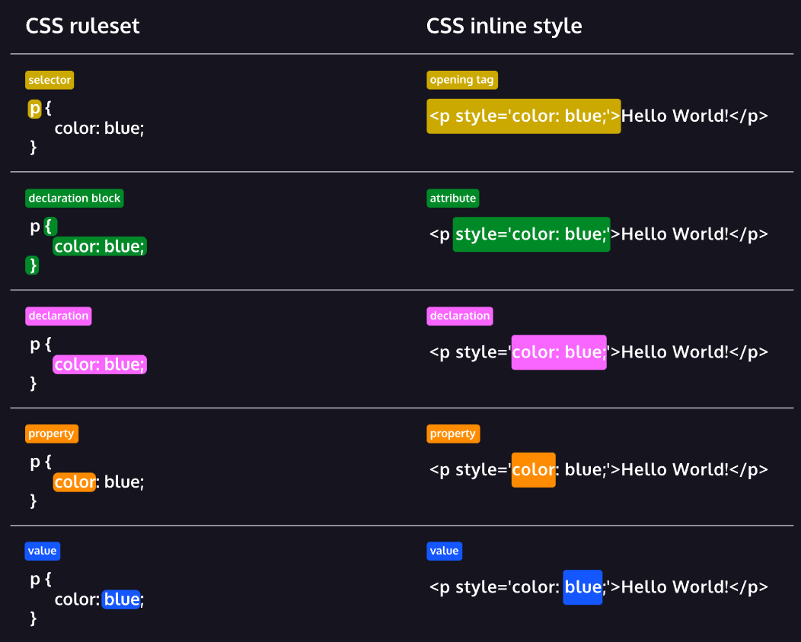

<link rel="stylesheet" type="text/css" href="CSS/styles.css">

# 1. Learn CSS - Selectors and Visual Rules

## 1.1. Setup and Syntax

- _**Cascading Style Sheets**_ or **CSS** is a language web developers use to style the HTML content on a web page.
- The CSS has two different syntaxes rules. The first is known as _Ruleset_, that is commonly used as a separate file, or inside a style tag. The second is known as _Inline Style_, that is a use in the HTML tag itself.

<p style="font-size: 20px; font-weight: 800; color: rgba(250, 200, 155, 0.8)">RULESET</p>

```css
selector {
  property: value;
}
```

<p style="font-size: 20px; font-weight: 800; color: rgba(250, 200, 155, 0.8)">INLINE STYLE</p>

```html
<tag style="property: value"></tag>
```



- Both methods contain common features in their _{++anatomy++}_. Notice how both syntaxes contain a declaration. Declarations are the core of CSS. They apply a style to the selected element.

### 1.1.1. Ruleset Terms

- **_Selector_** — The beginning of the ruleset used to target the element that will be styled.
- **_Declaration Block_** — The code in-between (and including) the curly braces ({ }) that contains the CSS declaration(s).
- **_Declaration_** — The group name for a property and value pair that applies a style to the selected element.
- **_Property_** — The first part of the declaration that signifies what visual characteristic of the element is to be modified.
- **_Value_** — The second part of the declaration that signifies the value of the property.

### 1.1.2. Inline Style Terms

- _**Opening Tag**_ — The start of an HTML element. This is the element that will be styled.
- **_Attribute_** — The style attribute is used to add CSS inline styles to an HTML element.
- _Declaration_ — The group name for a property and value pair that applies a style to the selected element.
- **_Property_** — The first part of the declaration that signifies what visual characteristic of the element is to be modified.
- **_Value_** — The second part of the declaration that signifies the value of the property.

### 1.1.3. Inline Styles

- Add the style attribute directly to the opening tag. After you add the attribute, you can set it equal to the CSS style(s) you'd like applied to that element.

```html
<p style="color:red;">I'm learning to code!</p>
```

### 1.1.4. Internal Stylesheet

- HTML allows you to write CSS code in its own dedicated section with a `<style>` element **nested inside** of the `<head>` element. The CSS code inside the `<style>` element is often referred to as an _internal stylesheet_.

```html {highlight=4-5}
<head>
  <style>
    p {
      color: red;
      font-size: 20px;
    }
  </style>
</head>
```

- The CSS code in the example above changes the color of all paragraph text to red (`color: red;`) and also changes the size of the text to 20 pixels (`font-size: 20px;`).

### 1.1.5. External Stylesheet and How to Link the CSS Files

- Developers avoid mixing code by storing HTML and CSS code in separate files (HTML files contain only HTML code, and CSS files contain only CSS code).
- You can create an external stylesheet by using the `.css` file name extension, like so: `style.css`
- With an external stylesheet, you can write all the CSS code needed to style a page without sacrificing the readability and maintainability of your HTML file.
- You can use the `<link>` element to link HTML and CSS files together. The `<link>` element must be placed within the head of the HTML file. _**It is a self-closing tag**_ and requires the following attributes:
  - `href` — like the anchor element, the value of this attribute _must be the address, or path, to the CSS file_.
  - `rel` — this attribute describes the relationship between the HTML file and the CSS file. Because you are linking to a stylesheet, the value should be set to _stylesheet_.

```html
<link
  href="URL_to_CSS_file"
  rel="stylesheet" />
```

- If the CSS file is stored in the same directory as your HTML file, then you can specify a _Relative Path_ instead of a URL, like so:

```html
<link
  href="./style.css"
  rel="stylesheet" />
```

## 1.2. Selectors

- Remember that _declarations_ are a fundamental part of CSS because they apply a style to a selected element. But how do you decide which elements will get the style? With a selector.
- A _**selector**_ is used to target the specific HTML element(s) to be styled by the declaration.
- One selector very familiar is the _**Type Selector**_. Just like its name suggests, the type selector _matches the type of the element in the HTML document_.
- Some important notes on the type selector:
  - The type selector does not include the angle brackets.
  - Since element types are often referred to by their opening tag name, the type selector is sometimes referred to as the tag name or element selector.

### 1.2.1. Universal Selector

- The universal selector selects all elements of any type.
- Targeting all of the elements on the page has a few specific use cases, such as resetting default browser styling, or selecting all _**CHILDREN**_ of a _**PARENT**_ element.

  - The Parent and Children names are used to describe the relation between two or more HTML or CSS elements. For example:

  ```html
  <main>
    <section>
      <h1></h1>
    </section>
  </main>
  ```

  - In this case we have that `<section>` and `<h1>` are _CHILDREN_ of `<main>`, with `<h1>` been children of `<section` too. `<main>` is a PARENT for `<section>` and `<section>` for `<h1>`.

- The universal selector uses the `*` (asterisk) character in the same place where you specified the type selector in a ruleset, like so:

```css
* {
  font-family: Verdana;
}
```

- In this last case, the font type Verdana was specified for all text elements in the document.

### 1.2.2. :warning: CLASS :warning:

- When working with HTML and CSS a class attribute is one of the most common ways to select an element.
- For example, consider the following HTML:

```html
<p class="brand">Sole Shoe Company</p>
```

- The paragraph element in the example above has a class attribute within the opening tag of the `<p>` element. The class attribute is set to **`'brand'`**. To select this element using CSS, we can create a ruleset with a class selector of `.brand`.
- To select an HTML element by its class using CSS, a period (`.`) must be prepended to the class's name. In the example above, the class is `brand`, so the CSS selector for it is `.brand`.
- Multiple classes can be assigned to a single element in a space-separated list, e.g, `class="class1 class2 class3"`.
- We can add multiple classes to an HTML element’s class attribute by separating them with a space. This enables us to mix and match CSS classes to create many unique styles without writing a custom class for every style combination needed.
- For `JavaScript` the class attribute can also be used to perform `JavaScript` operations on HTML elements. Through the _**Document Object Model (“DOM”)**_, there are various `JavaScript` methods built for selecting elements via their class.

```javascript
window.onload = function () {
  const subheadings = document.getElementsByClassName("sub-heading");

  for (let i = 0; i < subheadings.length; i++) {
    subheadings.item(i).innerText = `Sub-heading ${i + 1}`;
  }
};
```

- The code above is assigning an event handler to the `onload` property of the global `window` object in the browser. When the `window` as loaded, the elements with `class=sub-heading` are collected in `subheadings`. They are then looped over, their `innerText` property being changed each iteration.

### 1.2.3. :warning: ID :warning:

- Oftentimes it’s important to select a single element with CSS to give it its own unique style. If an HTML element needs to be styled uniquely, we can give it an _**ID**_ using the `id` attribute.

```html
<h1 id="large-title">...</h1>
```

- In contrast to class which accepts multiple values, and can be used broadly throughout an HTML document, **{++an element’s id can only have a single value++}**, and only be used once per page.
- To select an element’s ID with CSS, we prepend the id name with a number sign (#). In the preceding example, we can use `#large-title` to select the `<h1>` element with the same ID.

### 1.2.4. :warning: ATTRIBUTE :warning:

- The attribute selector can be used to target HTML elements that already contain attributes. Elements of the same type can be targeted differently by their attribute or attribute value. This alleviates the need to add new code, like the class or id attributes.
- Attributes can be selected similarly to types, classes, and IDs.

```css
[href] {
  color: magenta;
}
```

- The most basic syntax is an attribute surrounded by square brackets. In the above example: `[href]` would target all elements with an `href` attribute and set the color to magenta.

- And it can get more granular from there by adding type and/or attribute values. One way is by using `type[attribute*=value]`. In short, this code selects an element where the attribute contains any instance of the specified value. Let’s take a look at an example.

```html
 
```

- The HTML code above renders two `` elements, each containing a `src` attribute with a value equaling a link to an image file.

```css
img[src*="winter"] {
  height: 50px;
}

img[src*="summer"] {
  height: 100px;
}
```

- Now take a look at the above CSS code. The attribute selector is used to target each image individually. The first ruleset looks for an `img` element with an attribute of `src` that contains the string `'winter'`, and sets the `height` to `50px`. The second ruleset looks for an `img` element with an attribute of `src` that contains the string `'summer'`, and sets the `height` to `100px`.

### 1.2.5. Pseudo-Class (sudo-class)

- You may have observed how the appearance of certain elements can change, or be in a different state, after certain user interactions. For instance:
  - When you click on an `<input>` element, and a blue border is added showing that it is in focus.
  - When you click on a blue `<a>` link to visit to another page, but when you return the link’s text is purple.
  - When you’re filling out a form and the submit button is grayed out and _**disabled**_. But when all of the fields have been filled out, the button has color showing that it’s active.
- These are all examples of pseudo-class selectors in action! In fact,

  - `:focus`
  - `:visited`
  - `:disabled`
  - `:active`

  are all pseudo-classes. Factors such as user interaction, site navigation, and position in the document tree can all give elements a different state with pseudo-class.

- A pseudo-class can be attached to any selector. It is always written as a colon `:` followed by a name. For example `p:hover`.

```css
p:hover {
  background-color: lime;
}
```

### 1.2.6. CLASSES and IDs

- CSS classes and IDs have different purposes, which can affect which one you use to style HTML elements.
- CSS classes are meant to be _**reused over many elements**_. By writing CSS classes, you can style elements in a variety of ways by mixing classes.

  - For instance, imagine a page with two headlines. One headline needs to be bold and blue, and the other needs to be bold and green.
  - Instead of writing separate CSS rules for each headline that repeat each other’s code, it’s better to write a `.bold` CSS rule, a `.green` CSS rule, and a `.blue` CSS rule. Then you can give one headline the bold green classes, and the other the bold blue classes.

- While classes are meant to be used many times, an ID is meant to style only one element. IDs override the styles of types and classes. Since IDs override these styles, they should be used sparingly and only on elements that need to always appear the same.

### 1.2.7. Specificity

- Specificity is the order by which the browser decides which CSS styles will be displayed.
- A best practice in CSS is to style elements while using the lowest degree of specificity so that if an element needs a new style, it is easy to override.
- IDs are the most specific selector in CSS, followed by classes, and finally, type.
- For the selector that combines `type` and an `attribute` we have that will be superior at the `class` selector but inferior to the `id` selector.

```html
<h1 class="headline">Breaking News</h1>
```

```css
h1 {
  color: red;
}

.headline {
  color: firebrick;
}
```

- In the example code above, the `color` of the heading would be set to `firebrick`, as the class selector is more specific than the type selector.
- If an ID attribute (and selector) were added to the code above, the styles within the ID selector’s body would override all other styles for the heading.
- To make styles easy to edit, it’s best to style with a type selector, if possible. If not, add a class selector. If that is not specific enough, then consider using an ID selector.

### 1.2.8. Chaining

- When writing CSS rules, it’s possible to require an HTML element to have two or more CSS selectors at the same time.
- This is done by combining multiple selectors, which we will refer to as chaining. For instance, if there was a `special` class for `<h1>` elements, the CSS would look like below:

```css
h1.special {
}
```

- The code above would select only the `<h1>` elements with a class of `special`. If a `<p>` element also had a class of `special`, the rule in the example would not style the paragraph.
- This combined selector will have the same position that the `type[attribute=value]` selector.

### 1.2.9. Descendant Combinator

- CSS also supports selecting elements that are nested within other HTML elements, also known as _**descendants**_. For instance, consider the following HTML:

```html
<ul class="main-list">
  <li>...</li>
  <li>...</li>
  <li>...</li>
</ul>
```

- The nested `<li>` elements are descendants of the `<ul>` element and can be selected with the descendant combinator like so:

```css
.main-list li {
}
```

- In the example above, `.main-list` selects the element with the`.main-list` class (the `<ul>` element). The descendant `<li>`‘s are selected by adding li to the selector, separated by a space. This results in .main-list li as the final selector.
- Selecting elements in this way can make our selectors even more specific by making sure they appear in the context we expect.

### 1.2.10. Multiple Selectors

- In order to make CSS more concise, it’s possible to add CSS styles to multiple CSS selectors all at once. This prevents writing repetitive code.
- For instance, the following code has repetitive style attributes:

```css
h1 {
  font-family: Georgia;
}

.menu {
  font-family: Georgia;
}
```

- Instead of writing `font-family: Georgia` twice for two selectors, we can separate the selectors by a comma (`,`) to apply the same style to both, like this:

```css
h1,
.menu {
  font-family: Georgia;
}
```

- By separating the CSS selectors with a comma, both the `<h1>` elements and the elements with the menu class will receive the `font-family: Georgia` styling.

## 1.3. Values and Syntax

- Before entering the specific properties that we have, it's important to understand how the values in CSS are computed and how value definition syntax is used, for example, in the suggestions on an IDE. Let's begin with how the values are specified and computed.

### 1.3.1. Initial value

- The _**Initial Value**_ of a CSS property is its _default value_, as listed in its definition table in the specification. The usage of the initial value depends on whether a property is inherited or not:

  - For [inherited properties](#141-inherited-properties), the initial value is used on the **root element only**, as long as no [specified value](#132-specified-value) is supplied.
  - For [non-inherited properties](#142-non-inherited-properties), the initial value is used on _all elements_, as long as no specified value is supplied.
  - You can explicitly specify the initial value by using the `initial` keyword.

  ```css
  div {
    color: blue;
  }

  .initial {
    color: initial;
  }
  ```

  ```html
  <p>I have a black text as default. This is my initial value</p>
  <div>
    <p>
      For me, my text is blue because color is an inherited value, so I inherit the color from my parent div.
      But I don't have border because of the non-inheritance of border.
    </p>
    <p class="initial">
      Now, for me, I'm a paragraph nested in the div with blue color text, but even that, I have black text.
      Why? Because I was specified in the CSS as the value initial.
    </p>
  </div>
  ```

### 1.3.2. Specified Value

- Maybe the mainly used value in CSS. The **_Specified Value_** of a CSS property is the value it receives from the document's style sheet. The specified value for a given property is determined according to the following rules:

  - If the document's style sheet explicitly specifies a value for the property, the given value will be used.
  - If the document's style sheet doesn't specify a value but it is an _**[inherited property](#141-inherited-properties)**_, the value will be taken from the parent element.
  - If none of the above pertain, the element's _initial value_ will be used.

  ```css
  .fun {
    border: 1px dotted pink;
    font-family: fantasy;
  }

  p {
    color: green;
  }
  ```

  ```html
  <p>My color is green as given explicitly in the CSS.</p>
  <div>
    The specified values of all my properties default to their initial values or inheritance, because none of
    them are given in the CSS.
  </div>
  <div class="fun">
    <p>
      The specified value of my font family is not given explicitly in the CSS, so it is inherited from my
      parent (fantasy). However, the border is not an inheriting property, so I don't have a border.
    </p>
  </div>
  ```

### 1.3.3. Computed Value

- The _**computed value**_ of a CSS property is the value that is transferred from parent to child during _inheritance_. It is calculated from the [specified value](#132-specified-value) by:
  - Handling the special values `inherit`, `initial`, `revert`, `revert-layer`, and `unset`.
  - Doing the computation needed to reach the value described in the "Computed value" line in the property's definition table.
- The computation needed to reach a property's computed value typically involves converting relative values (such as those in `em` units or percentages) to absolute values. For example, if an element has specified values `font-size: 16px` and `padding-top: 2em`, then the computed value of `padding-top` is `32px` (double the font size).
- However, for some properties (those where percentages are relative to something that may require layout to determine, such as `width`, `margin-right`, `text-indent`, and `top`), **percentage-specified values turn into percentage-computed values**. Additionally, unitless numbers specified on the `line-height` property become the computed value, as specified. The relative values that remain in the computed value become absolute when the [used value](#134-used-value) is determined.

```css
div {
  font-size: 16px;
  line-height: 1.5;
  padding-top: 2em;
}

p {
  font-size: 12px;
  line-height: 1.2;
}
```

```html
<div>
  <p>
    The computed value of my font-size and line-height is the same as the specified value, because they are
    absolute values.
  </p>
  <p>
    The computed value of my padding-top is 32px, because it is a relative value that is calculated from the
    font-size of my parent.
  </p>
  <p>
    The used value of my font-size is 16px, because it is the computed value of my parent. The used value of
    my line-height is 24px, because it is the computed value of my parent. The used value of my padding-top is
    32px, because it is the computed value of my parent.
  </p>
</div>
```

### 1.3.4. Used Value

-

### 1.3.5. Value Definition Syntax

- **CSS value definition syntax**, a formal grammar, is used for defining the set of valid values for a CSS property or function. In addition to this syntax, the set of valid values can be further restricted by semantic constraints (for example, for a number to be strictly positive).
- The definition syntax describes which values are allowed and the interactions between them.
- A component can be a keyword, some characters considered as a **_literal_**, or a value of a given CSS data type or of another CSS property.
- In the value definition syntax, we have three different component value to adjust as value for a given property. They are: Types, Combinators, Multipliers.

#### 1.3.5.1. Component Value Types

##### 1.3.5.1.1. Keywords

- A keyword with a predefined meaning appears literally, without quotation marks. For example: `auto`, `smaller` or `ease-in`.
- _**All CSS properties**_ accept the keywords `inherit` (Herança), `initial` (Inicial) and `unset` (Desarmar, retirar), that are defined throughout CSS. They are not shown in the value definition, and are implicitly defined.

> **`inherit`**
>
> The `inherit` CSS keyword causes the element to take the computed value of the property from its parent element. It can be applied to any CSS property, including the CSS shorthand property `all`.
>
> For inherited properties, this reinforces the default behavior, and is only needed to override another rule.
>
> For example: suppose that we have
>
> ```html
> <p>Some text that have <em>this part emphasized</em>.</p>
> ```
>
> And for CSS we have
>
> ```css
> p {
>   border: 1px solid red;
> }
> ```
>
> For default, the `<em>` element won't be bordered because it's an element with non-inherited properties. So, if we declare
>
> ```css
> em {
>   border: inherit;
> }
> ```
>
> now the `<em>` element will be bordered because it will inherit the properties of your parent, the `<p>` element.

---

> **`initial`**
>
> The `initial` CSS keyword applies the _initial (or default) value_ of a property to an element. It can be applied to any CSS property, including the CSS shorthand property `all`. With `all` set to `initial`, all CSS properties can be restored to their respective initial values in one go instead of restoring each one separately.
>
> For example: suppose that we have
>
> ```html
> <p>
>   <span>This text is red.</span>
>   <em>This text is in the initial color (typically black).</em>
>   <span> This is red again.</span>
> </p>
> ```
>
> ```css
> em {
>   color: initial;
> }
> ```
>
> With the `initial` keyword in this example, `color` value on the `em` element is restored to the initial value of `color`, as defined in the specification.

---

> **`unset`**
>
> The `unset` CSS keyword resets a property to its inherited value if the property naturally inherits from its parent, and to its initial value if not. In other words, it behaves like the `inherit` keyword in the first case, when the property is an _inherited property_, and like the `initial` keyword in the second case, when the property is a _non-inherited property_.
>
> For example: suppose that we have
>
> ```html
> <p>This text is red.</p>
> <div class="foo">
>   <p>This text is also red.</p>
> </div>
> <div class="bar">
>   <p>This text is green (default inherited value).</p>
> </div>
> ```
>
> ```css
> .foo {
>   color: blue;
> }
>
> .bar {
>   color: green;
> }
>
> p {
>   color: red;
> }
>
> .bar p {
>   color: unset;
> }
> ```
>
> All paragraphs are set to have the `red` color, and because of that, the class `.foo` will be override, so the `<p>` inside the first `<div>` will have the color as `red`. But, for the `<p>` inside the second `<div>` with the class `.bar`, we defined the `color` property to `unset`, so, how `color` is a inherited property, this paragraph will have the same color that your parent, in this case `green`, because of the previous definition of the `.bar` class element `color` to `green`.

## 1.4. Inheritance

- In CSS, _**inheritance**_ controls what happens when no value is specified for a property on an element. CSS properties can be categorized in two types:
  - _**inherited properties**_, which by default are set to the computed value of the parent element;
  - _**non-inherited properties**_, which by default are set to initial value of the property;

### 1.4.1. Inherited Properties

- When no value for an **inherited property** has been specified on an element, the element gets the _**computed value**_ of that property on its parent element. Only the root element of the document gets the initial value given in the property's summary.
  - The

### 1.4.2. Non-Inherited Properties

-

## 1.5. Visual Rules

### 1.5.1. Font Family

- Font refers to the technical term typeface, or font family.
- To change the typeface of text on your web page, you can use the font-family property.

```css
h1 {
  font-family: Garamond;
}
```

- In the example above, the font family for all main heading elements has been set to `Garamond`.
- When setting typefaces on a web page, keep the following points in mind:

  - The font specified must be installed on the user’s computer or downloaded with the site.
  - Web safe fonts are a group of fonts supported across most browsers and operating systems.
  - Unless you are using web safe fonts, the font you choose may not appear the same between all browsers and operating systems.
  - When the name of a typeface consists of more than one word, it’s a best practice to enclose the typeface’s name in quotes, like so:

  ```css
  h1 {
    font-family: "Courier New";
  }
  ```

### 1.5.2. Font Size

- To change the size of text on your web page, you can use the `font-size` property.

```css
p {
  font-size: 18px;
}
```

- In the example above, the font-size of all paragraphs was set to 18px. px means pixels, which is one way to measure font size.

  - A pixel is one of several units of measure in web development. It is an absolute unit equal to 1/96 of an inch.
  - Another units that can be used are `rem` and `em`. `rem`'s and `em`'s are scalable typographic units which are commonly used with the `font-size` property. As opposed to pixels, both of these units are _**relative**_.
  - An `em` is measured relative to the `font-size` of an element. When dealing with `em`s it is important to realize that the `font-size` of an element is often _**inherited**_ from an **ancestor element**. For example:

  ```html
  <div style="font-size: 24px">
    <p>This text will be 24px, as inherited from the parent element.</p>
    <p style="font-size: 0.75em">This text will be 75% of the parent size (the div), i.e., 18px.</p>
  </div>
  ```

  - On the other hand, `rem`s are determined based on the `font-size` of the html element. If `font-size` is not defined on the html element, the browser’s default `font-size` is used instead (usually `16px`).
  - There are pros and cons of each unit but one major advantage of using relative units is that they lend themselves more naturally to responsive design. Relative units like `em`s and `rem`s are flexible and scalable whereas pixels are not.

### 1.5.3. Font Weight

- In CSS, the `font-weight` property controls how bold or thin text appears.

```css
p {
  font-weight: bold;
}
```

- In the example above, all paragraphs on the web page would appear bolded.
- The `font-weight` property has another value: `normal`. Why does it exist?
- If we wanted all text on a web page to appear bolded, we could select all text elements and change their font weight to `bold`. If a certain section of text was required to appear normal, however, we could set the font weight of that particular element to `normal`, essentially shutting off `bold` for that element.
