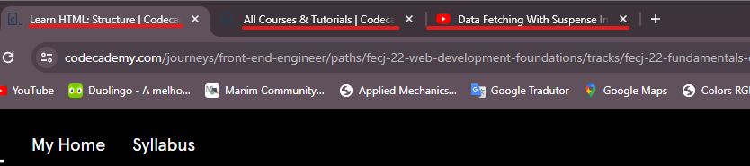
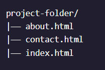
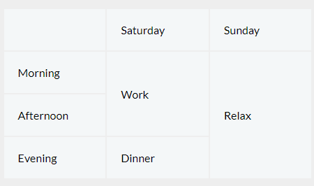

# 1. Fundamentals of HTML

- [ ] Understand how HTML is used for web development;
- [ ] Use HTML to build a structure for a website;
- [ ] Create tables in HTML documents;
- [ ] Write clearer, more accessible HTML using Semantic HTML tags;

A full list of available HTML tags can be found in [Mozilla documentation](https://developer.mozilla.org/en-US/docs/Web/HTML/Element).

## 1.1. Introduction to HTML

- So what exactly is HTML? HTML provides structure to the content appearing on a website, such as images, text, or videos.
- HTML stands for HyperText Markup Language:
  - A markup language is a computer language that defines the structure and presentation of raw text.
  - In HTML, the computer can interpret raw text that is wrapped in HTML elements.
  - HyperText is text displayed on a computer or device that provides access to other text through links, also known as hyperlinks. You probably clicked on a couple of hyperlinks on your way to this Codecademy course.
- A tag (`<tag_name></tag_name>`) and the content between it is called an HTML element. Opening Tag — the first HTML tag used to start an HTML element. The tag type is surrounded by opening and closing angle brackets. Content — The information (text or other elements) contained between the opening and closing tags of an HTML element. Closing tag — the second HTML tag used to end an HTML element. Closing tags have a forward slash (/) inside of them, directly after the left angle bracket.
- One of the key HTML elements we use to build a webpage is the **_Body_** element. Only the content inside the body tags can be displayed in the screen.

```html
<body>
  <p>What's up, man?</p>
</body>
```

- HTML is organized as a collection of family tree relationships.
- When an element is contained inside another element, it is considered the **_Child_** of that element. The child element is said to be **_Nested_** inside of the parent element.

```html
<body>
  <p>This paragraph ("p" element) is a child of the body</p>
</body>
```

- The `<p>` element is considered a child of the `<body>` element, and the `<body>` element is considered the parent.

- Consider another example:

```html
<body>
  <div>
    <h1>Sibling to p, but also grandchild of body</h1>
    <p>Sibling to h1, but also grandchild of body</p>
  </div>
</body>
```

- In this example, the `<body>` element is the parent of the `<div>` element. Both the `<h1>` and `<p>` elements are children of the `<div>` element. Because the `<h1>` and `<p>` elements are at the same level, they are considered siblings and are both grandchildren of the `<body>` element. This genealogic tree is called **_Hierarchy_**.
- It's important know about hierarchy because child elements can inherit behavior and styling from their parent element.
- **_Headings_** in HTML are similar to headings in other types of media. Usually, are used to catch the attention of the user.
- In HTML, there are six different headings, or heading elements.

```html
<h1>The Urge for Learning!</h1>
```

## 1.2. Learn HTML: Elements

- One of the most popular elements in HTML is the `<div>` element. `<div>` is short for “**_division_**” or a container that divides the page into sections.

```html
<body>
  <div>
    <h1>Why use divs?</h1>
    <p>Great for grouping elements!</p>
  </div>
</body>
```

- `<div>`s allow us to group HTML elements to apply the same styles for all HTML elements inside. We can also style the `<div>` element as a whole.
- _Attributes_ are content added to the opening tag of an element and can be used in several different ways, from providing information to changing styling.
- Attributes are made up of the following two parts: `name="value"`.
- One commonly used attribute is the id. We can use the id attribute to specify different content (such as `<div>`s) and is really helpful when you use an element more than once. ids have several different purposes in HTML, but for now, we’ll focus on how they can help us identify content on our page.

```html
<div id="intro">
  <h1>Introduction</h1>
</div>
```

- If you want to display text in HTML, you can use a **_Paragraph_** or **_Span_**:
  - Paragraphs `<p>` contain a block of plain text.
  - `<span>` contains short pieces of text or other HTML. They are used to separate small pieces of content that are on the same line as other content.

```html
<div>
  <h1>Technology</h1>
</div>
<div>
  <p>
    <span>Self-driving cars</span> are anticipated to replace up to 2 million jobs over the next two decades.
  </p>
</div>
```

- In the example above, there are two different `<div>`. The second `<div>` contains a `<p>` with `<span>`Self-driving cars`</span>`. This `<span>` element separates “Self-driving cars” from the rest of the text in the paragraph.
- You can also style text using HTML tags. The `<em>` tag emphasizes text, while the `<strong>` tag highlights important text.
  - The `<em>` tag will generally render as **_Italic Emphasis_**.
  - The `<strong>` will generally render as **_Bold Emphasis_**.
- If you are interested in modifying the spacing in the browser, you can use HTML’s line break element: `<br>`. The line break element is unique because it is only composed of a starting tag.
- In HTML, you can use an **_Unordered List_** tag `<ul>` to create a list of items in no particular order. This use a bullet point.
- **_Individual List_** items must be added to the unordered list using the `<li>` tag. The `<li>` or list item tag is used to describe an item in a list.
- **_Ordered lists_** `<ol>` are like unordered lists, except that each list item is numbered.
- The `` tag allows you to add an **_Image_** to a web page. Most elements require both opening and closing tags, but the `` tag is a **_Self-Closing_** tag. Self-closing tags may include or omit the final slash ( "/" ) — both will render properly.

```html
 or 
```

- The `` tag has a required attribute called **`src`**. The `src` attribute must be set to the image’s source, or the location of the image (on the web or local).
- The **`alt`** attribute, which means **_Alternative Text_**, brings meaning to the images on our sites. The `alt` attribute can be added to the image tag just like the `src` attribute. The value of `alt` should be a description of the image. If the image doesn't be loaded, or in case of an user be visually impaired, the alt attribute will give the information about the image in the site.

```html

```

- The `alt` attribute also plays a role in Search Engine Optimization (SEO), because search engines cannot “see” the images on websites as they crawl the internet. Having descriptive `alt` attributes can improve the ranking of your site.
- In addition to images, HTML also supports displaying **_Videos_**. Like the `` element, the `<video>` element requires a src attribute with a link to the video source. Unlike the `` element however, the `<video>` element requires an opening and a closing tag.

```html
<video
  src="myVideo.mp4"
  width="320"
  height="240"
  controls>
  Video not supported
</video>
```

- After the `src` attribute, the `width` and `height` attributes are used to set the size of the video displayed in the browser. The `controls` attribute instructs the browser to include basic video controls such as pausing and playing.

## 1.3. Learn HTML: Structure

### 1.3.1. The DOCTYPE Tag

- HTML files require certain elements to set up the document properly. We can let web browsers know that we are using HTML by starting our document with a document type declaration. The declaration looks like this:

```html
<!DOCTYPE html>
```

- This declaration is an instruction, and it _must be the first line of code_ in your HTML document. The declaration is referring to HTML5, as it is the current standard.
- Lastly, HTML code is always saved in a file with an **`.html`** extension.

### 1.3.2. HTML Tab

- To create HTML structure and content, we must add opening and closing `<html>` tags after declaring `<!DOCTYPE html>`:

```html
<!DOCTYPE html>
<html>
  <!--Anything between the opening <html> and closing </html> tags will be interpreted as HTML code.-->
</html>
```

### 1.3.3. HEAD Tag

- The `<head>` element is part of this HTML metaphor. It goes above our `<body>` element.
- The `<head>` element contains the metadata for a web page. Metadata is information about the page that isn’t displayed directly on the web page.
- A browser’s tab displays the title specified in the `<title>` tag. The `<title>` tag is always inside of the `<head>`.

```html
<!DOCTYPE html>
<html>
  <head>
    <title>My Coding Journal</title>
  </head>
</html>
```



### 1.3.4. ANCHOR Tag - Linking to Other Web Pages

- You can add links to a web page by adding an anchor element `<a>` and including the text of the link in between the opening and closing tags.
- The anchor element must contain the `href="https://someURL.com"` attribute. This attribute stands for **\*h**ypertext **ref**erence\* and is used to link to a path, or the address to where a file is located (whether it is on your computer or another location). The paths provided to the href attribute are often URLs.

```html
<a href="https://www.wikipedia.org/">This Is A Link To Wikipedia</a>
```

- The `target` attribute specifies how a link should open. For a link to open in a new window, the `target` attribute requires a value of `_blank`.

```html
<a
  href="https://en.wikipedia.org/wiki/Brown_bear"
  target="_blank"
  >The Brown Bear</a
>
```

- The `target="_blank"` attribute, when used in modern browsers, will open new websites in a new tab. There are other attributes like `_self` and `_parent` (see [Anchor Atributes](https://developer.mozilla.org/en-US/docs/Web/HTML/Element/a#target)).

#### 1.3.4.1. Linking to Relative Pages

- Many sites also link to internal web pages like _Home_, _About_, and _Contact_.
- When making multi-page static websites, web developers often store HTML files in the **_root directory_**, or a **_main folder_** where all the files for the project are stored. As the size of the projects you create grows, you may use additional folders within the main project folder to organize your code.



- The example above shows three different files — `about.html`, `contact.html`, and `index.html` in one folder.
- If the browser is currently displaying `index.html`, it also knows that `about.html` and `contact.html` are in the same folder. Because the files are stored in the same folder, we can link web pages together using a relative path.

```html
<a href="./contact.html">Contact</a>
```

- The `./` in `./index.html` tells the browser to look for the file in the current folder.

#### 1.3.4.2. Linking At Will

- Links not necessarily needs to be text. They can be images or other form of web content.
- HTML allows you to turn nearly any element into a link by wrapping that element with an anchor element. With this technique, it’s possible to turn images into links by simply wrapping the `` element with an `<a>` element.

```html
<a
  href="https://en.wikipedia.org/wiki/Opuntia"
  target="_blank">
  
</a>
```

#### 1.3.4.3. Linking to Same Page

- When users visit our site, we want them to be able to click a link and have the page automatically scroll to a specific section.
- In order to link to a target on the same page, we must give **_the target_** an **`id`**. An `id` should be descriptive to make it easier to remember the purpose of a link. The **_target link_** is a string containing the **`#`** character and the target element’s `id`.

```html
<ol>
  <!--References to a top id.-->
  <li><a href="#top">Top</a></li>
  <!--References to a bottom id.-->
  <li><a href="#bottom">Bottom</a></li>
</ol>
```

- An id is especially helpful for organizing content belonging to a `div`!

### 1.3.5. Whitespace

- Programmers use two tools to visualize the relationship between elements: **_whitespace_** and **_indentation_**.
- The browser ignores whitespace in HTML files when it renders a web page, so it can be used as a tool to make code easier to read and follow.
- The [World Wide Web Consortium](https://www.w3.org/), or W3C, is responsible for maintaining the style standards of HTML. At the time of writing, the W3C recommends **_2 spaces of indentation_** when writing HTML code.

### 1.3.6. Comments

- Comments begin with `<!--` and end with `-->`. Any characters in between will be ignored by your browser.
- Including comments in your code is helpful for many reasons: i) They help you (and others) understand your code if you decide to come back and review it at a much later date; ii) They allow you to experiment with new code, without having to delete old code.

## 1.4. Learn HTML: Tables

- To create a table we must use `<table>` tag to create this element.
- The `<table>` element will contain all of the tabular data we plan on displaying.
- The first step in entering data into the table is to add **_Rows_** using the table row element: `<tr>` (stands for _table row_).
- Each **_Cell Element_** must also be defined. In HTML, you can add data using the table data element: `<td>` (stands for _table data_).
- To add titles to rows and columns, you can use the **_table heading_** element: `<th>`. Just like table data, a table heading must be placed within a table row.
- The header for tables can use the `scope="value"` attribute, which can take one of the following values:
  - `row` - this value makes it clear that the heading is for a row.
  - `col` - this value makes it clear that the heading is for a column.
  - `rowgroup` - used for table headings that group multiple rows.
  - `colgroup` - used for table headings that group multiple columns.
  - `auto` - the default value
- The table borders can be set with the CSS. We don't use another way to include borders.
- Data can _**span columns**_ using the `colspan="value"` attribute. The attribute accepts an integer (greater than or equal to 1) to denote the number of columns it spans across.
- Data can also _**span multiple rows**_ using the `rowspan="value"` attribute. The `rowspan` attribute is used for data that spans multiple rows (perhaps an event goes on for multiple hours on a certain day). It accepts an integer (greater than or equal to 1) to denote the number of rows it spans across.

```html
<table>
  <tr>
    <!-- Row 1 -->
    <th></th>
    <th>Saturday</th>
    <th>Sunday</th>
  </tr>
  <tr>
    <!-- Row 2 -->
    <th>Morning</th>
    <td rowspan="2">Work</td>
    <td rowspan="3">Relax</td>
  </tr>
  <tr>
    <!-- Row 3 -->
    <th>Afternoon</th>
  </tr>
  <tr>
    <!-- Row 4 -->
    <th>Evening</th>
    <td>Dinner</td>
  </tr>
</table>
```



- Long tables can be sectioned off using the table body element: `<tbody>`. The `<tbody>` element should contain all of the table’s data, excluding the table headings.
- When a table’s body is sectioned off, however, it also makes sense to section off the table’s column headings using the `<thead>` element.
- The _**bottom part**_ of a long table can also be sectioned off using the `<tfoot>` element.
- Tables, by default, are very bland. They have no borders, the font color is black, and the typeface is the same type used for other HTML elements. _**CSS**_, or Cascading Style Sheets, is a language that web developers use to style the HTML content on a web page. You can use CSS to style tables. Specifically, you can style the various aspects mentioned above.

## 1.5. Semantic HTML

- The word _**semantic**_ means “relating to meaning,” so semantic elements provide information about the content between the opening and closing tags.
- By using Semantic HTML, we select HTML elements based on their meaning, not on how they are presented. Elements such as `<div>` and `<span>` are not semantic elements since they provide no context as to what is inside of those tags.
- For example, instead of using a `<div>` element to contain our header information, we could use a `<header>` element, which is used as a heading section. By using a `<header>` tag instead of a `<div>`, we provide context as to what information is inside of the opening and closing tag.

### 1.5.1. `<header>`

- A `<header>` is a container usually for either navigational links or introductory content containing `<h1>` to `<h6>` headings.
- A `<header>` element typically contains:
  - one or more heading elements (`<h1>` - `<h6>`)
  - logo or icon
  - authorship information
- **Note**: You can have several `<header>` elements in one HTML document. However, `<header>` cannot be placed within a `<footer>`, `<address>` or another `<header>` element.

### 1.5.2. `<nav>`

- A `<nav>` is used to define a block of navigation links such as menus and tables of contents. It is important to note that `<nav>` can be used inside of the `<header>` element but can also be used on its own.

```html
<header>
  <nav>
    <ul>
      <li><a href="#home">Home</a></li>
      <li><a href="#about">About</a></li>
    </ul>
  </nav>
</header>
```

### 1.5.3. `<main>` and `<footer>`

- Two more structural elements are `<main>` and `<footer>`. These elements along with `<nav>` and `<header>` help describe where an element is located based on conventional web development standards.
- The element `<main>` is used to encapsulate the dominant content within a webpage. This tag is separate from the `<footer>` and the `<nav>` of a web page since these elements don’t contain the principal content. By using `<main>` as opposed to a `<div>` element, screen readers and web browsers are better able to identify that whatever is inside of the tag is the bulk of the content.
- The content at the bottom of the subject information is known as the _**footer**_, indicated by the `<footer>` element. The footer contains information such as:
  - Contact information;
  - Copyright information;
  - Terms of use;
  - Site Map;
  - Reference to top of page links;

### 1.5.4. `<section>`

- According to W3C's HTML documentation: "_A section is a thematic grouping of content, typically with a heading._"
- `<section>` defines elements in a document, such as chapters, headings, or any other area of the document with the same theme. For example, content with the same theme such as articles about cricket can go under a single `<section>`. A website’s home page could be split into sections for the introduction, news items, and contact information.
  - Chapters
  - Introduction
  - News items
  - Contact information

### 1.5.5. `<article>`

- The `<article>` element holds content that makes sense on its own. `<article>` can hold content such as articles, blogs, comments, magazines, etc. An `<article>` tag would help someone using a screen reader understand where the article content (that might contain a combination of text, images, audio, etc.) begins and ends. With `<section>` and `<article>` we can put one inside the other. Who will be the parent and who will be the children will depend on the context.

### 1.5.6. `<aside>`

- The `<aside>` element is used to mark additional information that can enhance another element but isn’t required in order to understand the main content. This element can be used alongside other elements such as `<article>` or `<section>`. Some common uses of the `<aside>` element are for:
  - Bibliographies;
  - Endnotes;
  - Comments;
  - Pull quotes;
  - Editorial sidebars;
  - Additional information;

### 1.5.7. `<figure>` and `<figcaption>`

- `<figure>` is an element used to encapsulate media such as an image, illustration, diagram, code snippet, etc, which is referenced in the main flow of the document.
- It’s possible to add a caption to the image by using `<figcaption>`. `<figcaption>` is an element used to describe the media in the `<figure>` tag. Usually, `<figcaption>` will go inside `<figure>`.

```html
<figure>
  
  <figcaption>This picture shows characters from Overwatch.</figcaption>
</figure>
```

### 1.5.8. `<audio>`

- The `<audio>` element is used to embed audio content into a document. Like `<video>`, `<audio>` uses src to link the audio source.

```html
<audio>
  <source
    src="iAmAnAudioFile.mp3"
    type="audio/mp3" />
</audio>
```

- We specified the type by using `type="value"` and named what kind of audio it is. Although not always necessary, it’s recommended that we state the type of audio as it helps the browser identify it more easily and determine if that type of audio file is supported by the browser.
- _**Attributes**_ provide additional information about an element. Attributes allow us to do many different things to our audio file. There are many attributes for `<audio>` but we’re going to be focusing on `controls` and `src`.
  - `controls`: automatically displays the audio controls into the browser such as play and mute.
  - `src`: specifies the URL of the audio file.
- A full list of attributes can be found in the [MDN documentation](https://developer.mozilla.org/en-US/docs/Web/HTML/Element/audio#attributes).

### 1.5.9. `<video>`

- By using a `<video>` element, we can add videos to our website. The `<video>` element makes it clear that a developer is attempting to display a video to the user.
- Some attributes that can alter a video playback include:
  - `controls`: When added in, a play/pause button will be added onto the video along with volume control and a fullscreen option.
  - `autoplay`: The attribute which results in a video automatically playing as soon as the page is loaded.
  - `loop`: This attribute results in the video continuously playing on repeat.

### 1.5.10. `<embed>` :x: :heavy_exclamation_mark: (deprecated)

- Another tag that can be used to incorporate media content into a page is the `<embed>` tag, which can embed any media content including videos, audio files, and gifs from an external source. This means that websites that have an embed button have some form of media content that can be added to other websites. The `<embed>` tag is a self-closing tag, unlike the `<video>` element. Note that `<embed>` is a _**deprecated tag**_ and other alternatives, such as `<video>`, `<audio>` and ``, should be used in its place, but is being taught for legacy purposes.

### 1.5.11. `<details>` and `<summary>`

- The `<details>` and `<summary>` tags are used to mark up a collapsible section of content. The `<summary>` tag is used to mark up the title of the section, and the `<details>` tag is used to mark up the content itself.

```html
<details>
  <summary>Click to expand</summary>
  <p>Content goes here</p>
</details>
```

### 1.5.12. `<mark>`

- The `<mark>` tag is used to mark up text that has been highlighted for some reason. This might include things like search results, or text that has been highlighted by a user.

### 1.5.13. `<time>`

- The `<time>` tag is used to mark up a date or time. By using the `<time>` tag, you can make it easier for search engines and other technologies to understand the meaning of the content on your page.
  - `datetime` attribute indicates the time and/or date of the element and must be in one of the formats described below.
    - a valid year string: `2011`
    - a valid month string: `2011-11`
    - a valid date string: `2011-11-18`
    - a valid yearless date string: `11-18`
    - a valid week string: `2011-W47`
    - a valid time string: `14:54`, `14:54:39`, `14:54:39.929`
    - a valid local date and time string: `2011-11-18T14:54:39.929`, `2011-11-18 14:54:39.929`
    - a valid global date and time string: `2011-11-18T14:54:39.929Z`, `2011-11-18T14:54:39.929-0400`, `2011-11-18T14:54:39.929-04:00`, `2011-11-18 14:54:39.929Z`, `2011-11-18 14:54:39.929-0400`, `2011-11-18 14:54:39.929-04:00`
    - a valid duration string: `PT4H18M3S`

### `<progress>`

- The `<progress>` tag is used to mark up a progress bar. By using the `<progress>` tag, you can make it easier for users to understand the progress of a task.

```html
<progress
  value="50"
  max="100"></progress>
```

## 1.6. REVIEW

- `<header>` for top-level content;
- `<nav>` for navigation menu;
- `<main>` for main content of site;
- `<footer>` for footer content;
- `<section>` for specific content in the main;
- `<article>` for content that makes sense on its own such as articles, blgs, comments, etc.;
- `<aside>` for content related to the main content, but not always necessary;
- `<figure>` for all types of media;
- `<figcaption>` for describe the media in figure;
- `<video>` for video files;
  - `controls`: he browser will offer controls to allow the user to control video playback, including volume, seeking, and pause/resume playback;
  - `controlslist`: helps the browser select what controls to show for the video element whenever the browser shows its own set of controls (that is, when the controls attribute is specified). The allowed values are `nodownload`, `nofullscreen` and `noremoteplayback`;
  - `height`: in CSS pixels;
  - `poster`: A URL for an image to be shown while the video is downloading. If this attribute isn't specified, nothing is displayed until the first frame is available, then the first frame is shown as the poster frame;
  - `width`: in CSS pixels.
- `<audio>` for audio files;
  - `controls`;
  - `controlslist`: `nodownload`, `nofullscreen` and `noremoteplayback`
  - `src` or the `<source>` element.
